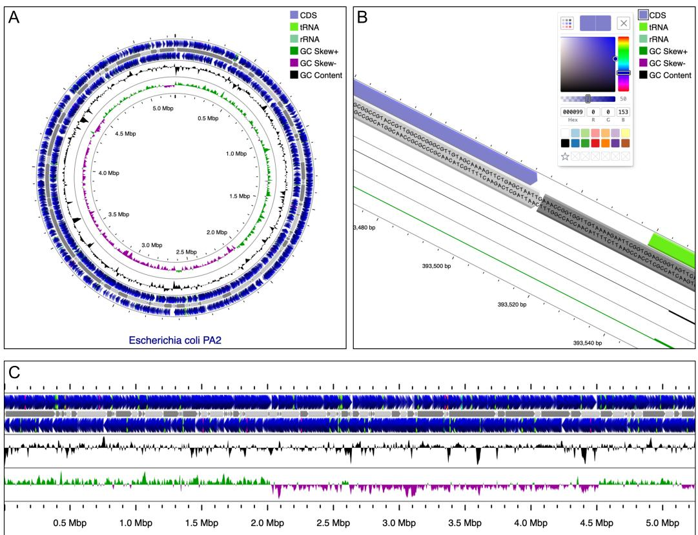

# CGView.js: a JavaScript package for visualizing small genomes

Jason R. Grant 1¶ and Paul Stothard 1

1 University of Alberta, Canada ¶ Corresponding author

DOI: 10.21105/joss.09930

## Software

• Review

• Repository

• Archive

Editor: Abhishek Tiwari

## Reviewers:

• @jkanche

• @haessar

Submitted: 04 September 2025   
Published: 01 June 2026

## License

Authors of papers retain copyright and release the work under a Creative Commons Attribution 4.0 International License (CC BY 4.0).

## Summary

Genome maps are routinely generated as a way of understanding or conveying the functional properties and sequence characteristics of organisms. CGView.js is a JavaScript-based viewer designed for microbial and organellar genomes, as well as plasmids. Inspired by the original Java-based CGView (Stothard & Wishart, 2005), it generates high-quality interactive maps that can easily be embedded in web pages. Its comprehensive API supports map manipulation and integration with third-party tools, making it suitable for developers building bioinformatics platforms.

## Statement of need

Microbial and organellar genomics frequently require circular maps and fast navigation between scales. Existing circular visualization tools such as Circos (Krzywinski et al., 2009) and the original Java-based CGView generate high-quality genome figures, but they produce static PNG/SVG outputs that must be regenerated to reflect changes, limiting interactive exploration. CGView.js addresses this need by providing circular and linear map layouts with nucleotide-level detail as an embeddable JavaScript component, combining smooth zooming and panning with dynamic, programmatic updates through an extensive API. Figure 1 shows examples of CGView.js circular and linear layouts, plus a zoomed view that displays base-pair detail.

## State of the field

Several JavaScript-based genome browsers, including JBrowse (Diesh et al., 2023), igv.js (Robinson et al., 2022), and pileup.js (Vanderkam et al., 2016), are widely used for general genomics visualization. However, few support the circular maps that are often preferred for microbial and organellar genomes, and none provide the rapid and smooth zooming to the DNA sequence level available in CGView.js. CGView.js complements these tools by focusing on circular visualization and tight integration into web pipelines rather than operating as a standalone browser.

## Software design

CGView.js is an embeddable interactive map component, intended to be tightly integrated into and managed by surrounding web applications. The API exposes common actions on map components such as features, tracks, contigs, legends, and labels. A standard set of actions is provided (read, add, remove, update, reorder). All actions (except “read”) trigger events that can be used as hooks for callbacks. For example, the features-add event passes the added features to a callback, enabling host tools to react dynamically.

  
Figure 1: CGView.js maps of the Escherichia coli PA2 genome (GenBank accession: GCF\_000335355.2) displaying sequence features and base composition plots. (A) Circular view of the genome. (B) Circular view zoomed to the base pair level, with the legend color picker shown in the top-right corner. (C) Linear view of the same genome.

Maps are rendered using the HTML canvas rather than SVG, which significantly improves performance when displaying thousands of features. During animations such as zooming or panning, the number of visible features is temporarily reduced to maintain responsiveness. Once the animation completes, the map is redrawn at full detail.

CGView.js uses web workers to create GC skew, GC content, and ORF tracks based on the provided genome sequence. Web workers generate these tracks in background threads without blocking the user interface, allowing users to continue moving, zooming, or interacting with the map. These processes communicate with the main thread to provide visual feedback in the form of a growing progress track. When the worker is finished, the progress track is replaced with the new plot or set of features.

The performance of CGView.js depends on the capabilities of the host system. No internal limits are set on genome size or the number of features that can be displayed. However, large genomes (e.g. more than 10 million base pairs) and large numbers of features (e.g. millions) can result in slower map rendering and navigation. For this reason, we recommend using CGView.js primarily for microbial and organellar genomes.

CGView.js maps can be quickly generated for sequences in GenBank, EMBL, and FASTA formats using the companion CGParse.js package (https://github.com/sciguy/cgview-parse). Features described in GenBank and EMBL files are automatically converted into CGView.js features for display on the map. CGParse.js can also convert GFF3, GTF, BED, CSV, and TSV files into CGView.js map features, allowing results from a variety of other sources (e.g. third-party analysis tools) to be easily visualized.

Configuration and interchange rely on a lightweight CGView JSON format that stores genome information and display settings. Maps can be imported from and exported to this format for sharing and archiving. Publication-ready output is supported through PNG export up to 16,000 × 16,000 pixels and SVG export for downstream vector editing.

## Research impact statement

Since its release in 2021, CGView.js has been integrated into multiple online bioinformatics platforms and web servers, including Proksee (Grant et al., 2023), PHASTEST (Wishart, Han, et al., 2023), PlasMapper 3.0 (Wishart, Ren, et al., 2023), MOBHunter (Rojas-Villalobos et al., 2025), PLSDB (Molano et al., 2024), BASys2 (Poelzer et al., 2025), and HLRMDB (Zhai et al., 2025). In Proksee, hundreds of CGView.js maps are downloaded daily, indicating active external use.

The project website (https://js.cgview.ca) provides detailed documentation, examples, and tutorials that generate interactive maps directly from the shown code, supporting reproducibility and community uptake. Users who prefer a graphical interface can use Proksee (Grant et al., 2023), which renders maps with CGView.js and exposes many viewer settings through a GUI.

## Conclusion

CGView.js enables the generation of high-quality interactive and static genome maps for microbial and organellar genomes. Its embeddable JavaScript design and comprehensive API make it suitable for integration into web-based platforms that visualize genomic annotations or pipeline outputs.

## AI usage disclosure

Generative AI (ChatGPT) was used occasionally for issue triage, small code suggestions, and copy editing of documentation and this manuscript. All AI-assisted code and text were reviewed and verified by the authors. No figures or data were generated by AI.

## Acknowledgements

This work was funded by Genome Alberta and Genome Canada.

## Author contributions

Jason Grant: Conceptualization (equal); Methodology; Software; Visualization; Writing (original draft). Paul Stothard: Conceptualization (equal); Supervision; Writing (review and editing); Funding acquisition; Resources.

## References

Diesh, C., Stevens, G. J., Xie, P., Martinez, T. D. J., Hershberg, E. A., Leung, A., Guo, E., Dider, S., Zhang, J., Bridge, C., Hogue, G., Duncan, A., Morgan, M., Flores, T., Bimber, B. N., Haw, R., Cain, S., Buels, R. M., Stein, L. D., & Holmes, I. H. (2023). JBrowse 2: a modular genome browser with views of synteny and structural variation. Genome Biology, 24(1), 74. https://doi.org/10.1186/s13059-023-02914-z

Grant, J. R., Enns, E., Marinier, E., Mandal, A., Herman, E. K., Chen, C., Graham, M., Domselaar, G. V., & Stothard, P. (2023). Proksee: in-depth characterization

and visualization of bacterial genomes. Nucleic Acids Research, 51(W1), W484–W492. https://doi.org/10.1093/nar/gkad326

Krzywinski, M., Schein, J., Birol, I., Connors, J., Gascoyne, R., Horsman, D., Jones, S. J., & Marra, M. A. (2009). Circos: an information aesthetic for comparative genomics. Genome Research, 19(9), 1639–1645. https://doi.org/10.1101/gr.092759.109

Molano, L.-A. G., Hirsch, P., Hannig, M., Müller, R., & Keller, A. (2024). The PLSDB 2025 update: enhanced annotations and improved functionality for comprehensive plasmid research. Nucleic Acids Research, 53(D1), D189–D196. https://doi.org/10.1093/nar/ gkae1095

Poelzer, J., Han, S., Saha, S., Oler, E., Kruger, R., Berjanskii, M., MacKay, S., & Wishart, D. S. (2025). BASys2: a next-generation bacterial genome annotation system. Nucleic Acids Research, gkaf360. https://doi.org/10.1093/nar/gkaf360

Robinson, J. T., Thorvaldsdottir, H., Turner, D., & Mesirov, J. P. (2022). igv.js: an embeddable JavaScript implementation of the Integrative Genomics Viewer (IGV). Bioinformatics, 39(1), btac830. https://doi.org/10.1093/bioinformatics/btac830

Rojas-Villalobos, C., Ossandon, F. J., Castillo-Vilcahuaman, C., Sepúlveda-Rebolledo, P., Castro-Salinas, D., Zapata-Araya, A., Arisan, D., Perez-Acle, T., Issotta, F., Quatrini, R., & Moya-Beltrán, A. (2025). MOBHunter: a data integration platform for identification and classification of mobile genetic elements in microbial genomes. Nucleic Acids Research, gkaf396. https://doi.org/10.1093/nar/gkaf396

Stothard, P., & Wishart, D. S. (2005). Circular genome visualization and exploration using CGView. Bioinformatics (Oxford, England), 21(4), 537–539. https://doi.org/10.1093/ bioinformatics/bti054

Vanderkam, D., Aksoy, B. A., Hodes, I., Perrone, J., & Hammerbacher, J. (2016). pileup.js: a JavaScript library for interactive and in-browser visualization of genomic data. Bioinformatics, 32(15), 2378–2379. https://doi.org/10.1093/bioinformatics/btw167

Wishart, D. S., Han, S., Saha, S., Oler, E., Peters, H., Grant, J. R., Stothard, P., & Gautam, V. (2023). PHASTEST: faster than PHASTER, better than PHAST. Nucleic Acids Research. https://doi.org/10.1093/nar/gkad382

Wishart, D. S., Ren, L., Leong-Sit, J., Saha, S., Grant, J. R., Stothard, P., Singh, U., Kropielnicki, A., Oler, E., Peters, H., & Gautam, V. (2023). PlasMapper 3.0—a web server for generating, editing, annotating and visualizing publication quality plasmid maps. Nucleic Acids Research. https://doi.org/10.1093/nar/gkad276

Zhai, Z., Che, X., Shen, W., Zhang, Z., Li, Y., & Pan, J. (2025). HLRMDB: a comprehensive database of the human microbiome with metagenomic assembly, taxonomic classification, and functional annotation by analysis of long-read and hybrid sequencing data. Nucleic Acids Research, gkaf1152. https://doi.org/10.1093/nar/gkaf1152