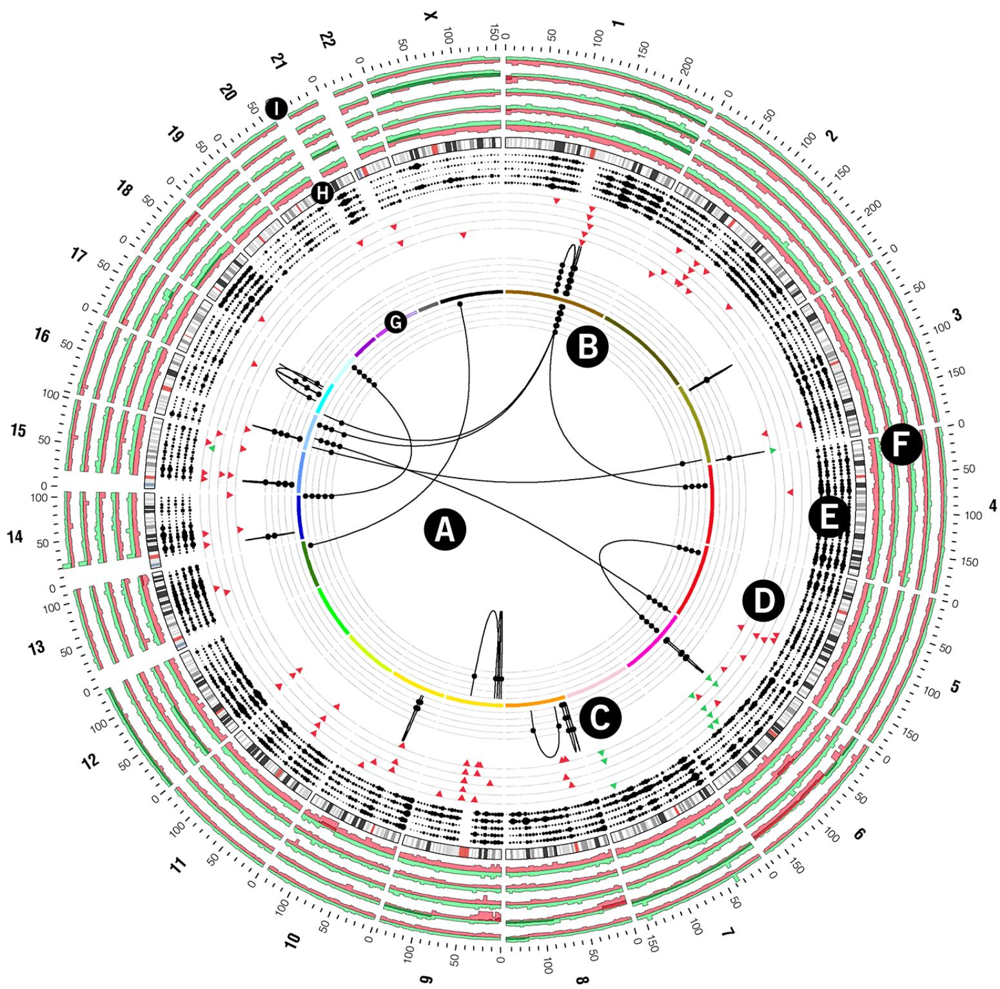
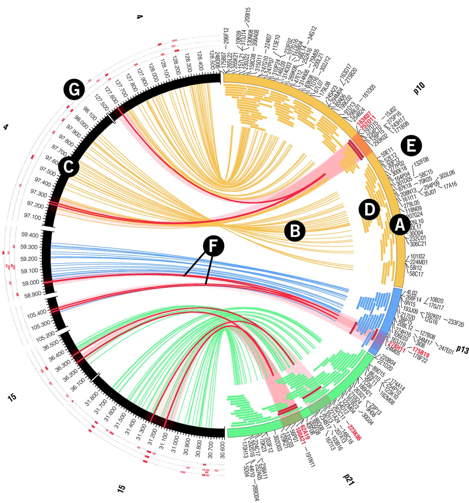
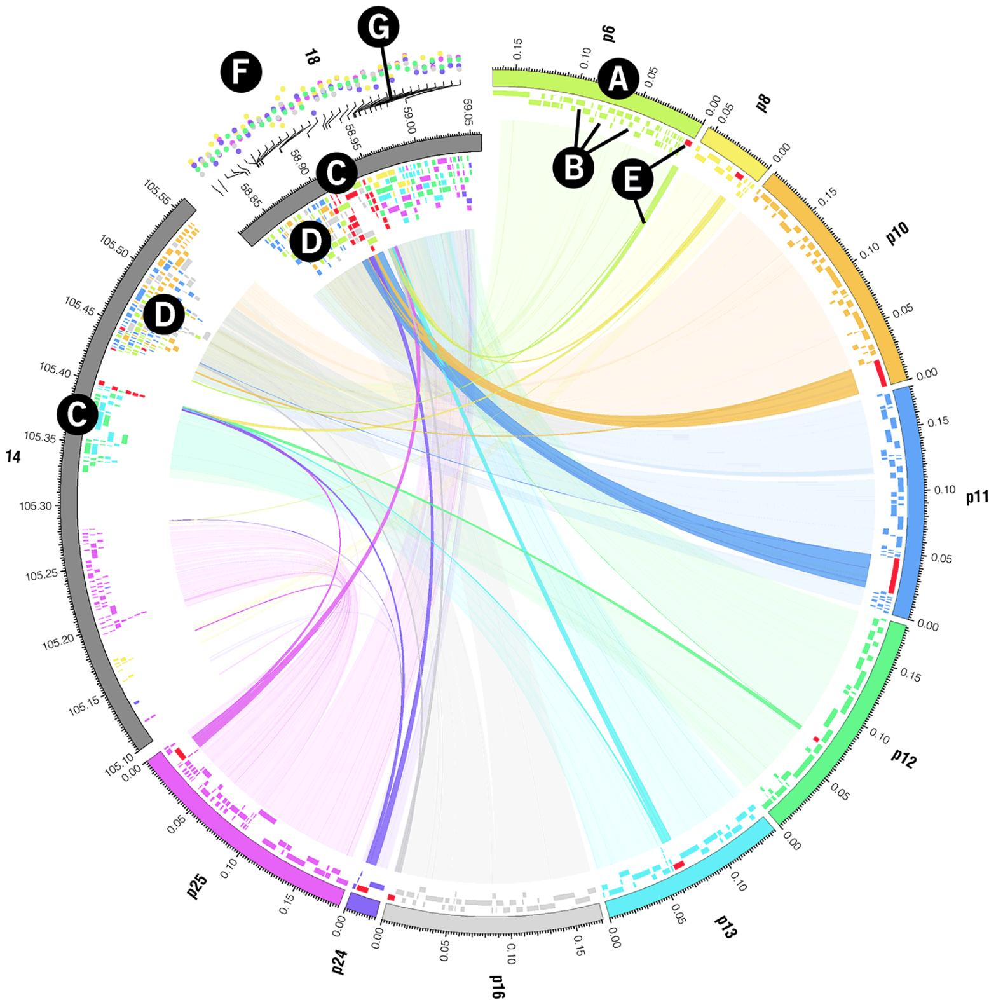
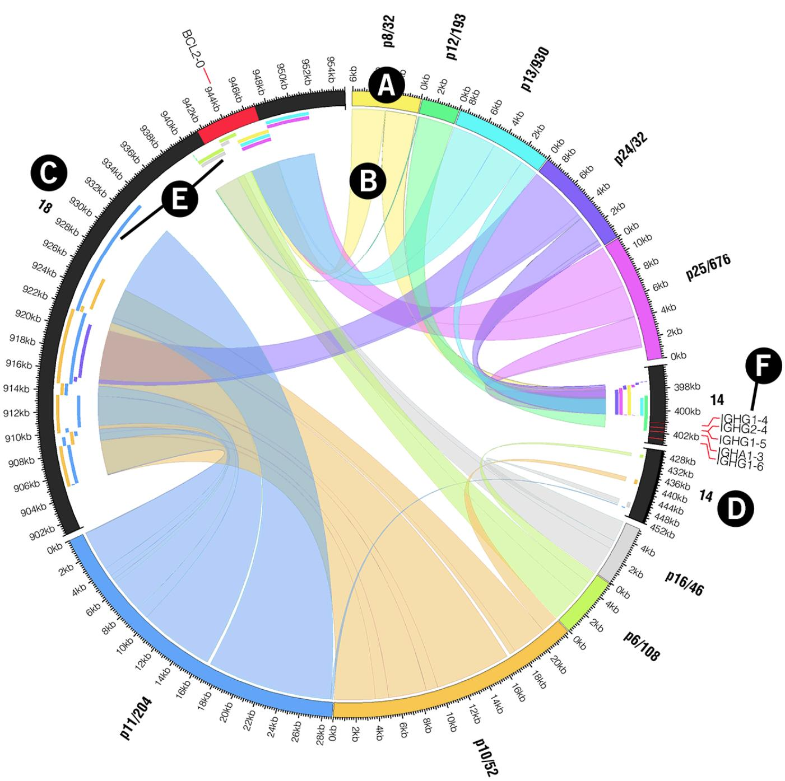
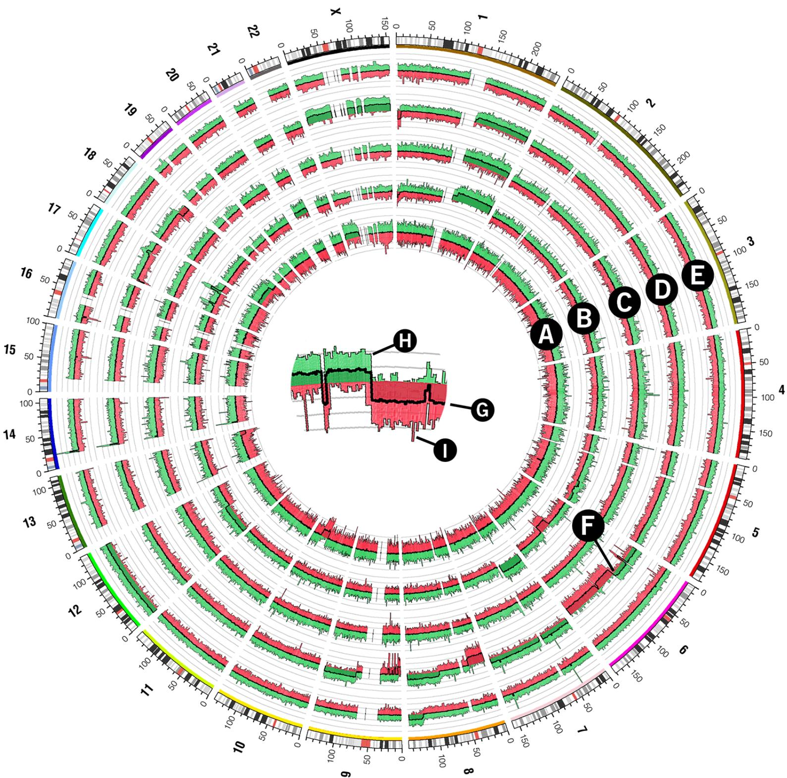
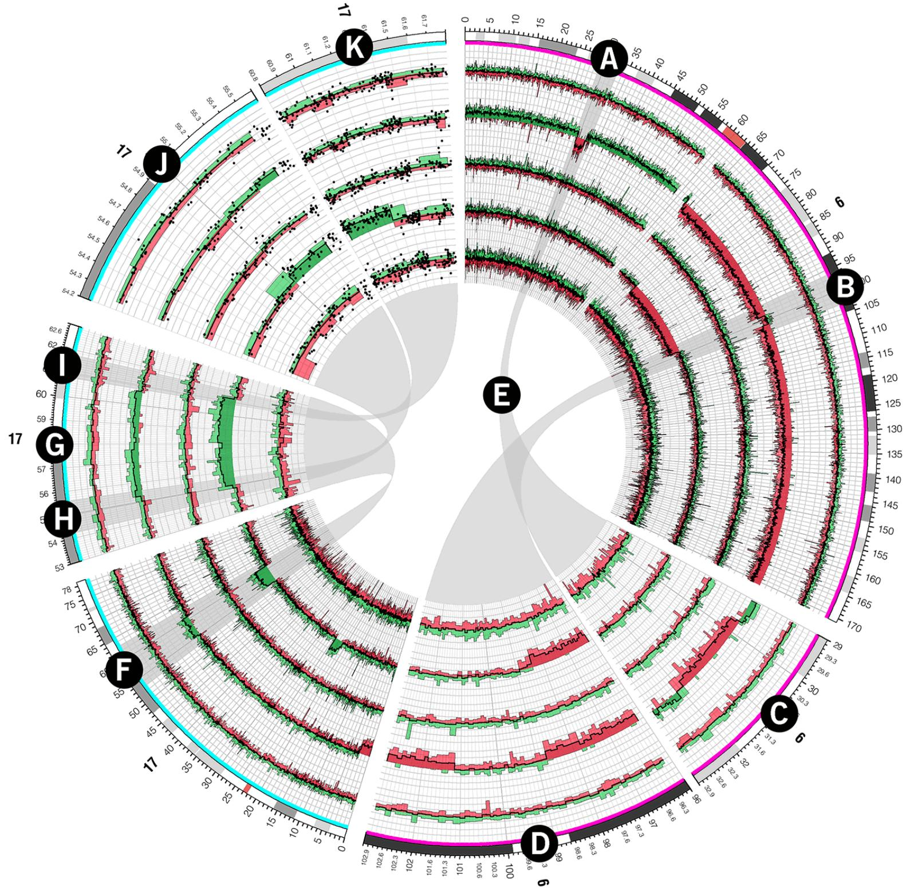
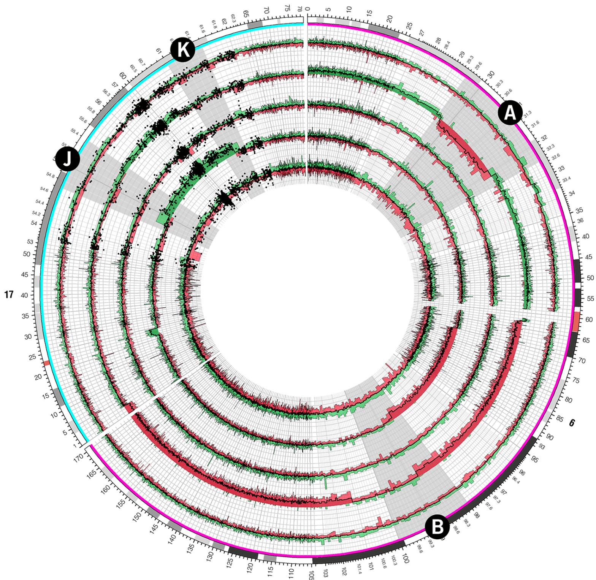
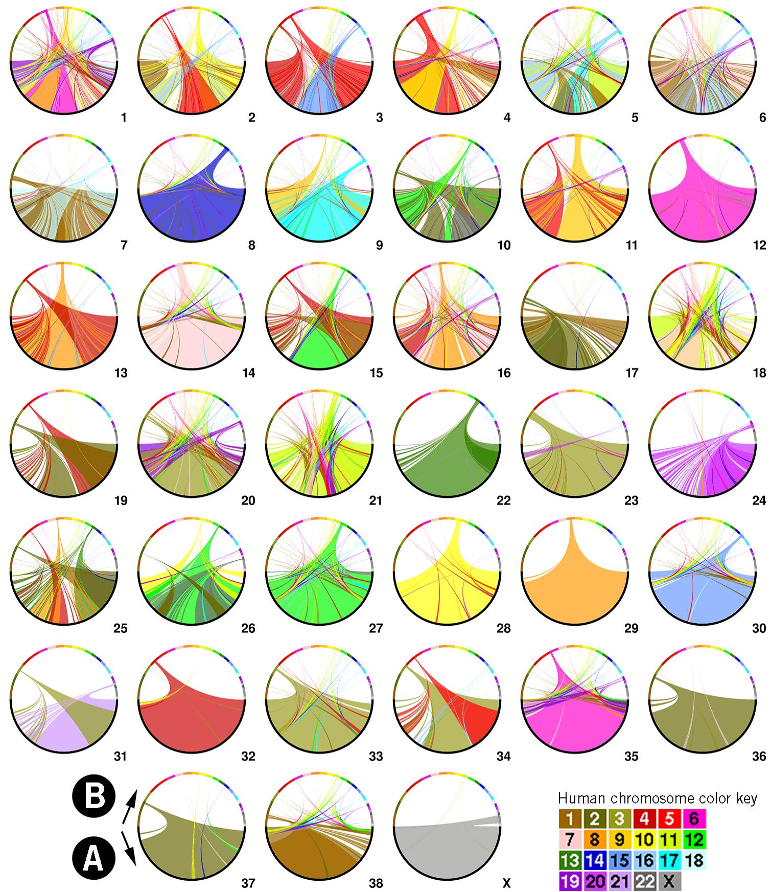

# Circos: an Information Aesthetic for Comparative Genomics

Martin Krzywinski1, Jacqueline Schein1, Inanc Birol1, Joseph Connors2, Randy Gascoyne2, Doug Horsman2, Steven J. Jones1, Marco A. Marra

1Canada’s Michael Smith Genome Sciences Center, 100-570 West 7th Avenue, Vancouver, BC, V5Z 4S6, Canada

2British Columbia Cancer Research Center, British Columbia Cancer Agency, 675 West 10th   
Avenue, Vancouver, BC, V5Z 1L3, Canada   
Correspondence should be addressed to MK (martink@bcgsc.ca)

## ABSTRACT

We created a visualization tool, called Circos, to facilitate the identification and analysis of similarities and differences arising from comparisons of genomes. Our tool is effective in displaying variation in genome structure and, generally, any other kind of positional relationships between genomic intervals. Such data are routinely produced by sequence alignments, hybridization arrays, genome mapping, and genotyping studies. Circos uses a circular ideogram layout to facilitate the display of relationships between pairs of positions by the use of ribbons, which encode the position, size, and orientation of related genomic elements. Circos is capable of displaying data as scatter, line and histogram plots, heat maps, tiles, connectors and text. Bitmap or vector images can be created from GFF-style data inputs and hierarchical configuration files, which can be easily generated by automated tools, making Circos suitable for rapid deployment in data analysis and reporting pipelines. Circos is licensed under GPL and available at http://mkweb.bcgsc.ca/circos. An interactive online version of Circos designed to visualize tabular data can be found at http://mkweb.bcgsc.ca/circos/tableviewer.

## INTRODUCTION

The continuing advances in speed, quality and affordability of whole genome analysis, including genome sequencing, have transitioned the comparative genomics field from the realm of comparing reference sequence assemblies to comparing assemblies of individual genomes. Whereas inter-species analysis leverages information about one species to further the understanding of the biological mechanisms in another, comparative methods are now used to discover differences between individuals and the extent to which these differences affect their response to the environment, such as susceptibility to disease and responsiveness to therapy.

Our growing ability to collect enormous amounts of sequence information to support such studies is arguably outpacing the rate at which we devise new methods to store, process, analyze and visualize these data. Any new approaches in data modeling and analysis need to be accompanied with corresponding innovations in the visualization of these data. To mitigate the inherent difficulties in detecting, filtering and classifying patterns within large data sets, we require instructive and clear visualizations that (1) adapt to the density and dynamic range of the data, (2) maintain complexity and detail in the data, and (3) scale well without sacrificing clarity and specificity.

The application of a germane data representation and its corresponding visualization to a domain-specific problem has historically improved the effectiveness of not only the presentation of the data, but also its analysis and dissemination. In some cases, the benefit of a new approach has altered how these data are perceived and investigated. Examples of this include the application of tree maps to show distribution of disk usage on a file system (Johnson and Shneiderman 1991) and hierarchical biological data (McConnell et al. 2002), directed graphs to depict networks, pathways, and phylogenetic information (Ciccarelli et al. 2006; Darwin 1859; Letunic and Bork 2007), and clustered heat maps to visualize array and expression data (Eisen et al. 1998; Sneath 1957). These approaches exemplify the virtues of an effective visualization: clarity, a high data-to-ink ratio (Tufte 1992) and favourable scaling characteristics. They have been widely adopted because they addressed pressing visualization problems within a domain where data sets were previously opaque to effective visual inspection.

Presently, a pressing visualization problem lies in the domain of comparative genomics, and specifically in the comparative genomics of individuals. We need to establish a visual paradigm for displaying relationships between genomes in order to leverage the large amounts of sequence data that have been collected and to expand the power of the field of personal genomics. Previous efforts to visualize positional relationships applied linearly arranged ideograms, connected by lines, to represent rearrangements (Choudhuri et al. 2004; Dicks 2000; Engels et al. 2006; Jakubowska et al. 2007; Kozik et al. 2002; Kuenne et al. 2007; Lee et al. 2006; Sinha and Meller 2007; Yang et al. 2003). One approach uses encoding in HSL (hue, saturation, lightness) color space to perform three-way comparisons (Baran et al. 2007). The methods embodied in these approaches are effective for illustrating local alignments between similar sequences. However, the shortcoming of the linear layout becomes apparent in representations that associate many ideograms with numerous relationships (e.g. Fig 2c in (Lee et al. 2006)). In such figures, multitudes of lines transgress unrelated ideograms and make patterns very difficult to discern. To mitigate this, color maps are used (e.g. Fig 2 in (Sinha and Meller 2007)) as an effective way to represent large syntenic blocks. Although color maps address the problem of overburdened visualizations by mapping a position pair onto a position and a color, they reduce the texture and richness of the data. Circularly arranged ideograms are prevalent in visualizations of microbial genomes, which are circular (Ghai and Chakraborty 2007; Gibson and Smith 2003; Kerkhoven et al. 2004; Pritchard et al. 2006; Sato and Ehira 2003; Stothard and Wishart 2005). At least one report combined paired-position data with a circular layout to show relationships between genomic positions (specifically, pathways) (Ekdahl and Sonnhammer 2004) and hinted at the benefit of adopting the circular layout for application to structural data.

To address the challenge in displaying large volumes of genomic rearrangement data we have developed Circos, which applies the circular ideogram layout to display of relationships between genomic intervals. This approach builds on the established use of circular maps in which concept relationships extracted from text are displayed (Zytkow and Rauch 1999). Circos’ initial application was to visualize end-sequence profiling (Volik et al. 2003) and fingerprint profiling (Krzywinski et al. 2007) of cancer genomes.

Although Circos is general and useable in any data domain, features have been added to mitigate inherent difficulties in visualizing large-scale multi-sample genomic data. Specifically, to address the issue of sparseness, the scale on each ideogram can be independently adjusted (both locally and globally) to attenuate or increase the visibility of a region. To accommodate visualizations that focus on regions of interest, axis breaks can be used to map chromosomes onto any number of ideograms which themselves can be drawn in any order or orientation. To help demonstrate patterns in the data, data points can have their value and format characteristics altered by flexible rules. Finally, to help integrate Circos into analysis pipelines, the software is driven by flat-text configuration files which can be created and adjusted automatically to create visualizations as part of an analysis workflow.

Circos is a mature software package and has been used to display genomic data (Campbell et al. 2008; Constantine 2007; Hampton et al. 2009; Jaillon et al. 2007; Meyer et al. 2009), in online genomics resources (Forbes et al. 2008), mainstream periodicals and newspapers (Constantine 2007; Duncan 2007; Ostrander 2007; Zimmer 2008) as well as to visualize data from other fields of study (Corum and Hossain 2007).

## RESULTS

## Platform and Configuration

Circos is a command-line application written in Perl, thus is easily deployable on any system for which Perl is available (http://www.cpan.org/ports/). Inputs are GFF-style data files and Apachelike configuration files – both can be easily generated by automated tools. Configuration elements are made modular, and can be reused by importing configuration parameters from multiple files. Each data track can contain a rule block that filter and format data elements based on position, value or previous formatting. Output images can be created in PNG (8- or 24-bit) or SVG formats. Configuration and data files required to create versions of Figures 1-8 are available as Supplementary Material.

## Applications

To illustrate how Circos’ functionality can be applied to comparative and personal genomics, we present a series of image archetypes (Figures 1-4) with data that are being used as part of a multipatient whole-genome analysis (unpublished; see Methods) of genomic rearrangements in follicular lymphoma, a common B-cell malignancy. These images range in resolution from whole-genome (3 Gb), to a fingerprint-map contig (10 Mb), to a single Bacterial Artificial Chromosome (BAC) clone (100kb), and finally to a sequence contig (10kb). A second image series (Figures 5-7) demonstrates how axis breaks and ideogram magnification can be used to zoom in on regions of interest. Batch image generation is demonstrated in Figure 8, which comprises 39 images that illustrate synteny between the dog and human genomes. The configuration and data files to create each figure are available in Supplementary Materials.

## Whole-Genome View of Genomic Rearrangements

Figure 1 shows a whole-genome visual representation of genomic rearrangements in multiple genomes with the aim to identify breakpoint clusters and recurrent alterations. Presented are structural data derived from primary tumor samples from five patients diagnosed with follicular lymphoma. For each sample, the figure shows large-scale rearrangements, density of small-scale events and copy number profile (see Methods). For example, at 130Mb on chromosome 1 each sample has large deletions, inversions as well as translocations that involve chromosomes 4, 16 and 17. This region also marks the beginning of significantly increased copy number in three samples (middle three rings in track F) that continues to the end of the 1q arm.

The resolution of a whole-genome view precludes the display of individual small-scale events at their native scale. To overcome this, Circos’ scatter, histogram and text tracks can be used as density plots, such as in Figure 1 E where glyph size is proportional to the number of small-scale events in each 5Mb region.

A whole-genome view such as this can act as a departure point for more in-depth investigation. Presently, we focus on the recurrent t(14;18) translocation between BCL2 and IGH gene regions, typical of follicular lymphoma (Yunis et al. 1982), and use Figure 1 as the initial image in a series that demonstrates the use of Circos at higher magnification. Using image maps, a feature currently in development, Figure 1 could be made interactive online, with elements being clickable for displaying features or their annotation in greater depth.

## Identifying BACs Spanning Rearrangement Breakpoints

A BAC-based fingerprint map was generated for each primary tumor sample and each BAC was annotated with fingerprint-based alignments to the human reference sequence (see Methods). In this manner, the fingerprint map, which is typically composed of 1000’s of contigs, was used to identify large-scale structural changes in the tumor genomes. Figure 2 demonstrates three such large-scale changes at the magnification level of a single fingerprint map contig (1-10Mb). Each contig (Figure 2 A) was selected from the map of a different sample (patients 10, 13 and 21) and contains at least two BAC clones whose alignments (Figure 2 F) indicate a rearrangement breakpoint captured within the BACs.

At this magnification, the correspondence between the order of BACs in the map contig and on the sequence assembly can be demonstrated clearly and used to identify structural changes in the tumor genomes. For example, the fingerprint-based alignments map BACs 163K07 and 252O11 from a contig of patient 10 onto two regions of chromosome 4 (97.1-98.1Mb, 127.5-128.5Mb), indicating that these BACs capture a rearrangement. Moreover, alignments from the second half of this contig are inverted in their progression, relative to clone order, suggesting that the rearrangement is an inversion. The classical t(14;18) translocation is exemplified by the alignments of BACs 175B19 and 278H11 from a contig of patient 13. The rearrangement in the map contig from patient 21 presents in a more complex fashion and is likely due to either an inversion or deletion.

The magnification of ideograms in Figure 2 is sufficiently high to allow for the display (track G) of small-scale events (indels or SNPs), which previously appeared in a density track (Figure 1, E). The layout in Figure 2 permits identification of any correlation between these events and rearrangements. Since these small-scale events are still much smaller than their associated glyph, the glyphs are magnified and scaled proportionally to the size of the event using data remap rules in the configuration of track G.

Views such as Figure 2 competently show the structural correspondence between representations of two genomes, such as those of a tumor sample and a reference. Other juxtapositions of this kind are common, such as two representations of the same genome (e.g. physical map and sequence assembly, to cross-validate their construction), or a representation of two closely related genomes (e.g. a physical map of one bacterial strain and sequence assembly of another, to study inter-strain variation).

## Identifying Sequence Contigs Containing Breakpoints

As part of our whole-genome analysis of the structure of follicular lymphomas, we used shortread Illumina technology to fully sequence a set of BAC clones that capture putative rearrangements. In Figure 3 we show the sequence assembly of nine such BACs (from patients 6, 8, 10, 11, 12, 13, 16, 24 and 25) which capture the t(14;18) translocation to illustrate the fact that this rearrangement’s breakpoint position is variable, as previously reported (Bakhshi et al. 1987; Cleary and Sklar 1985; Marculescu et al. 2002).

In Figure 3, sequence contigs which capture the t(14;18) translocation can be easily identified, as can be the coverage of adjacent sequence by neighboring sequence contigs. These breakpoint

contigs are highlighted in red and have their alignment ribbons drawn at higher opacity (Figure 3, E). The application of transparency to image elements allows layering of data, such as ribbons, or data tracks, such as histograms. The tile track (Figure 3, B and D) is used to represent the extent of BAC sequence contigs (B) on the reference sequence assembly (D).

## Exploring Breakpoint Structure

Sequence contigs that were found to span the breakpoint (Figure 3, E) are shown at higher magnification in Figure 4. This figure demonstrates the precise structure of alignments within the breakpoint cluster on 14q32 and 18q21, vis-à-vis exon structure of BCL2 and IGH in these regions. In this figure, sequence contig ideograms are interspersed with reference assembly ideograms to better separate the ribbon groups to chromosomes 14 and 18.

Circos can draw ideograms in any order and orientation – in Figure 4 the scale of sequence contigs progresses counterclockwise, while the scale of reference sequence ideograms progresses clockwise. Precise tick mark and tick label control is possible, including placement of the tick ring and formatting of tick labels. In Figure 4, to maintain relevant precision and avoid long labels, the tick labels of reference sequence ideograms are abbreviated to their last three digits (e.g. the position 58,910kb is shown as 910kb), which are the only digits that change in the labels across the image.

## Local and Global Scale Transformation

A unique aspect of Circos is its ability to adjust the global magnification for each ideogram and, furthermore, to smoothly vary the magnification within a region. This kind of local scale adjustment is effective to emphasize fine structure of data in a region while preserving context.

Figure 5 depicts one kind of dense data set that benefits from examination at various length scales. This figure shows whole-genome copy number profile of five lymphoma samples generated using the Affymetrix Mapping 500k array. Although there are several large regions in which copy number values are consistently altered, most of the statistically significant variation in the figure occurs over short distances which cannot be effectively shown at this resolution. Moreover, values of very few of the array probe values depart sufficiently from the average to be meaningful, making regions of interest in the data set sparse.

Figure 5 suggests an abrupt change in copy number at about 60Mb of chromosome 6 (F) and spikes in copy number increase on chromosome 17, but detail of these features cannot be discerned at this scale. To explore these regions in detail, Figure 6 uses breakout ideograms at higher magnification. Here, the global scale for each ideogram is adjusted independently (from 5x to 40x magnification) to show the fine structure in the data. By imposing a minimum distance between adjacent tick marks and their labels, Circos automatically renders tick mark labels for smaller intervals in zoomed regions (Figure 6 C, D, J, K). Using rules that toggle the visibility of data elements, individual array probe values are superimposed on the average histogram tracks in the region of Figure 6 J,K.

Whereas Figure 6 used breakout ideograms to render regions of chromosomes 6 and 17 in greater detail, Figure 7 accomplishes the same task by continuous magnification increase in the regions of interest. Regions A and B on chromosome 6 are smoothly zoomed to 10x

magnification and regions J and K on chromosomes 17 are zoomed to 20x. With this approach, the profile of individual probe values in a region of interest can be shown while keeping the rest of the data in view.

## Whole-Genome Syntenic Profile

Sequence similarity profiles between two genomes are complex and difficult to visualize. By grouping adjacent regions of similarity into larger syntenic blocks, the data can be distilled into a visual form that is both coherent and interpretable (see Methods). Figure 8 illustrates how synteny between two genomes can be shown at a scale of 250kb. Each panel in the figure represents the synteny between a single dog chromosome and the entire human reference sequence. By representing these blocks as transparent ribbons, it is possible to indicate multiple similarity targets for a given stretch of dog sequence (e.g. dog chromosome 31 which shows similarity to both human chromosomes 3 and 21), rather than a single consensus target.

## Run-Time Rules

Through rule blocks in the configuration file, Circos allows for control over visibility and format of every data element based on its position, value or format characteristics. Run-time rules permit changing the appearance of a figure within regions of interest (or ranges of data values), without needing to provide a new data set. Rules can simplify the task of identifying patterns in data by applying formatting that contrasts a subset of the data to the baseline.

Rules facilitate batch generation of a panel of images such as Figure 8. Each image in the panel was generated from the same configuration file and execution varied only in command-line parameters that specified the identity of the dog chromosome and the scale at which it should be shown. In this figure, rules were used to color ribbons based on human chromosome target and to hide ribbons with ends smaller than 250kb to limit the complexity of the figure. Rule blocks were used in nearly every figure, such as in Figure 3 to extend alignment curves to ticks for BACs with translocations, in Figure 5 to color parts of the histogram based on the sign of the probe value, and in Figure 6 to limit the display of probe values to breakout ideograms of chromosomes 17.

## DISCUSSION

Circos has been used to visualize data from the field of genomics, generate images for book and magazine covers, and even to provide scientific context to a David Cronenberg cinema artbook (De Gaetano 2008). It can generate images that are clear and informative to the investigator and attractive and compelling to the general public.

The core strengths of Circos are two-fold. First, Circos provides an effective and scalable means to illustrate relationships between genomic positions. The comparison of intervals, such as sequences and genome assemblies is common-place and Circos fills a need to visualize information in this data domain. Second, Circos is designed to allow flexible and easy rearrangement of elements in the image. While the circular framework of ideograms forms the foundation, the extent to which data tracks and their content can be visualized remains to be explored by the imagination of the investigator. An extensive online set of tutorials (presently there are about 80 tutorials), each with a thorough discussion of a specific feature and with sample images, configuration files and data. Each tutorial provides a set of recipes that can be used as a departure point in generating visualizations of common data sets.

The flexibility of layout and formatting of graphical elements allows the creation of a diverse visualizations in various data domains. For example, Circos can be effectively used to graphically represent tabular data. In this application the concept of ideograms is subverted – ideograms do not represent regions of chromosomes but individual rows or columns of a table. A ribbon, instead of a structural relationship, represents the value of a cell for a given row and column.

A recurring challenge with genomic data is its sparseness and the small size of features relative to the supporting scale. For example, a rearrangement data set may be a list of small deletions, sized on the order of 1kb. Features of this size cannot be drawn to scale on an ideogram, requiring the use of a density plot (Figure 1 E). However, by employing run-time rules, it is possible to automatically resize these small features to a size that is discernable (Figure 2 G). It is equally challenging to effectively represent sparse or non-uniformly distributed data, which inherently do not make effective use of the space within a figure. An example of these kind of data is epigenomic methylation state information, which is sampled at a large but non-uniformly distributed positions in the genome (Eckhardt et al. 2006). Circos was applied to visualize these data in (Zimmer 2008), using a connector track (also used in Figure 3 G) to map non-uniformly distributed genomic primer positions at which methylation values were measured with uniformly distributed stacked histograms that relate the extent of methylation.

## METHODS

## Whole-Genome Structural Data of Follicular Lymphomas

The multi-patient data set and corresponding in-depth analysis of the structure of the lymphoma genomes will be presented in detail elsewhere. In this presentation we focus on illustrating how Circos can be used to interrogate these and similar data and we include a brief snapshot of the data set here to orient the reader in interpreting the visualizations.

Whole-genome structural data (unpublished) from primary tumor samples from patients diagnosed with follicular lymphoma was used to generate Figures 1-7. A BAC library was created from each tumor sample (average insert size of libraries ranged between 130 and 200 kb) and subjected to restriction-digest fingerprinting (Marra et al. 1997; Mathewson et al. 2007; Schein et al. 2004) using a EcoRI/EcoRV double digest to a depth of 5- to 6-fold. Rearrangements (translocations, inversions, deletions) were identified from alignments of fingerprinted BACs onto the reference sequence (Krzywinski et al. 2007). Copy number changes in the samples were identified using the Affymetrix Mapping 500k array. Individual BACs identified to capture rearrangements were subject to short-read Illumina sequencing and assembled with ABySS (Simpson et al. 2009).

## Generation of Synteny Bundles between Dog and Human Genome

Sequence similarity data relating the dog (UCSC, canFam2, May 2005) and human (UCSC, hg18, Mar 2006) genomes were downloaded from the UCSC Genome Browser from the chainCanFam2 table (track: Dog Chain, track group: Comparative Genomics). This data set comprises about 2.16 million gapped alignments between the two assemblies. Alignment bundles were built up from individual alignments by a scheme (implemented by bundlelinks, a utility tool in the circos-tools distribution) which grouped alignments into sets. For a given alignment set (a) all alignments related the same pair of dog and human chromosomes, (b) any alignment was no more than 250 kb away from its nearest neighbor in the set, and (c) the number of alignments in the set was at least 3. Each set is represented in Figure 8 as a ribbon, whose ends represent the extent of the set alignments on the dog and human chromosomes. Figure 8 shows sets that spanned at least 250kb on both human and dog chromosome.

## Utility Tools

Several utility tools are bundled with Circos to help analyze, filter and format data. filterlinks parses a link file and selects only those links that pass positional criteria. orderchr applies simulated annealing to a link data set to generate an ideogram order that minimizes (or maximizes) the number of links that cross in the image. bundlelinks is used to identify links that are corroborated by other adjacent links (used for Figure 8). binlinks is used to generate density tracks, suitable for scatter/line/histogram tracks, based on the number of links within a sliding window. tableviewer is a collection of tools that is used to parse tabular data and generate data and configuration files for visualizing tables with Circos.

## ACKNOWLEDGMENTS

MK would like to thank the many individuals who send invaluable suggestions, comments and bug reports (specifically, Perseus Missirlis, Gordon Robertson, Martin Rijlaarsdam, Stefan Conrady) as well as Art Directors who helped Circos enter the public frey (David Constantine (New York Times), Jonathan Corum (New York Times), John Grimwade (Conde Nast), Domenico de Gaetano (Volumina), Derek Bacchus (Pearson Science), Barbara Aulicino (American Scientist), Nikki Greenwood (Seed Magazine)). Authors would like to thank the members of the GSC mapping group for preparing the raw data presented in this work, especially Matthew Field and Andrew Mungall for helpful discussions. MAM and SJJ are scholars of the Michael Smith Foundation for Health Research. Development of Circos was supported by Genome Canada and Genome British Columbia, and the National Cancer Institute/Terry Fox Foundation.

## FIGURE LEGENDS

Figure 1. A whole-genome view of structural changes in five follicular lymphoma tumor samples observed using restriction digest fingerprints and Affymetrix Mapping 500k arrays. Each of chromosomes 1-22,X are represented by circularly arranged ideograms (H), demarcated by a megabase scale on the outer rim of the figure (I). A stylized and color-coded instance of each ideogram is found in track G. Data tracks (B-F) comprise five concentric rings, each corresponding to a different sample. Translocations are shown in track A as curves that connect regions brought into adjacency by the rearrangement. Each curve is associated with a specific sample by circular glyphs in track B attached to the sample’s ring. Track C shows inversions by curves pointing outward from the center. Large-scale deletions and insertions are shown as red and green triangular glyphs, respectively, in track D. The density of small-scale indels is shown in track E, where the size of the circular glyph for each 5Mb region is proportional to the number of events in the region. Copy number information for each of the five samples is shown in track F, which comprises five concentric rings of histograms. Each histogram in track F shows the average copy number value across 1,000 probes, as well as the minimum and maximum 3-probe average within each 1,000 probe subset (see Figure 5 for details).

Figure 2. Ordered clone structure of three fingerprint map contigs (colored segments at right of figure, e.g. A) from three follicular lymphoma tumor samples. Fingerprint-based alignments for each clone are shown as curves (B) from the middle of the clone to the corresponding genomic region (C). Fingerprinted clones are represented as tiles in track D, with clone names shown in track E. Clones that have multiple alignments to distant genomic regions are highlighted in red (e.g. 175B19 in sample 13). The alignments and extent of these clones on the map contig and genomic region are similarly highlighted (F). Small-scale indels detected by fingerprints in each of the three samples is shown in track G, in three concentric rings. The glyphs used for the smallscale indels are magnified to be discernable (events are too small to directly show at this scale) and proportional to the size of the indel.

Figure 3. Alignment of short-read Illumina assemblies of BAC clones capturing the t(14;18) translocation in nine distinct follicular lymphoma tumor samples. Each BAC assembly is represented by a colored segment (A) and its individual sequence contigs are represented as tiles (B). Ribbons inside the image connect the sequence contigs within the BAC assembly to their alignments on the reference assembly (C) on chromosomes 14 (105.1-105.56Mb) and 18 (58.83- 59.06Mb). The position of the contig alignments on the reference assembly is shown as tiles in track D, and assigned the same color as the corresponding BAC. Sequence contigs that capture a translocation are highlighted in red (E) and have their alignment ribbons strongly colored and these alignments are shown in red in track D. Affymetrix probe values for each of the nine samples are shown in track F as a scatter plot, using the same color scheme as for the BAC segments, with the radial position of the glyph proportional to the copy number value. The probe position within this region of chromosome 18 is not uniform, and a connector track (G) is used to relate the original probe positions to a uniformly distributed layout in track F.

Figure 4. Detailed sequence alignments of sequence contigs from nine follicular lymphoma tumor samples (see Figure 3, track C) that were found to span translocations. Each of the contigs is represented by a colored segment (A) with a label that encodes the patient and contig number (e.g. p25/676 refers to patient 25, sequence contig 676). Sequence alignments of the contig are shown as ribbons (B) to regions of chromosome 14 (C, 105.396-105.403 Mb and 105.436-

105.452Mb) and chromosome 18 (D, 58.901-58.955Mb). Extent of each alignment is shown as tiles in track E, colored after corresponding sequence contig. Gene exons in the vicinity are labeled in track F and suffixed with their order within the gene (e.g. BCL2-0 is the first exon, BCL2-1 the next, etc.).

Figure 5. Copy number whole-genome profiles of five follicular lymphoma tumor samples generated from the Affymetrix Mapping 500K array. Samples are represented in each of the five histograms in tracks A-E. A crop of histogram region F is shown in the center of the figure to demonstrate the structure of each histogram track. The central thick line (G) represents the average probe value across 250 adjacent probes. The area between this line and the y=0 is filled green or red depending on whether the average value is positive (i.e. increased copy number value), or negative (decreased copy number value), respectively. Variability within each 1,000 probe set is shown in histogram components H and I which show the maximum and minimum of 3-probe average values within the set, respectively. Area between the maximum and minimum traces is filled with a lighter green or red, respectively.

Figure 6. Copy number profiles for chromosomes 6 and 17 of five follicular lymphoma tumor samples generated from the Affymetrix Mapping 500K array. Probe values were averaged across 20 adjacent probes. Several regions showing large copy number changes are shown on ideograms with an expanded scale. The structure of the histogram track is the same as used in Figure 5. Regions A and B on chromosomes 6 are shown at 10x magnification on ideograms C and D, respectively, with ribbons E connecting these regions with their zoomed ideograms. Similarly, region F on chromosome 17 is shown at 5x magnification as ideogram G. Regions H and I on ideogram G are shown at 40x magnification on ideograms J and K, respectively. Individual probe values are shown as scatter plots on ideograms J and K.

Figure 7. Copy number profiles for chromosomes 6 and 17 of five follicular lymphoma tumor samples generated from the Affymetrix Mapping 500K array. Regions of interest A and B on chromosomes 6 and J and K on chromosomes 17 (corresponding to similarly labeled zoomed ideograms in Figure 6) are magnified by a continuous scale expansion in these regions. Individual probe values are shown as a scatter plot in the vicinity of regions J and K.

Figure 8. Whole-genome profile of conserved synteny between dog (chromosomes 1-38, X) and human genomes (chromosomes 1-22, X, Y). Each of the 39 images in the panel shows sequence similarity between a single dog chromosome (A, expanded to fill bottom half of the image and progressing counterclockwise from 9 o’clock position) and the entire human genome (B, scaled to fill top half of the image, and progressing clockwise from 9 o’clock position). Sequence similarity was derived from gapped alignments of dog and human sequence assemblies. Adjacent alignments were grouped into bundles (see Methods), which are shown as ribbons colored by the target human chromosome according to the color key in the figure.

Downloaded from genome.cshlp.org on November 6, 2017 - Published by Cold Spring Harbor Laboratory Press

  
Figure 1

  
Figure 2

  
Figure 3

  
Figure 4

  
Figure 5

  
Figure 6

  
Figure 7

  
Figure 8

## REFERENCES

Baran, R., M. Robert, M. Suematsu, T. Soga, and M. Tomita. 2007. Visualization of three-way comparisons of omics data. BMC Bioinformatics 8: 72.

Campbell, P.J., P.J. Stephens, E.D. Pleasance, S. O'Meara, H. Li, T. Santarius, L.A. Stebbings, C. Leroy, S. Edkins, C. Hardy, J.W. Teague, A. Menzies, I. Goodhead, D.J. Turner, C.M. Clee, M.A. Quail, A. Cox, C. Brown, R. Durbin, M.E. Hurles, P.A. Edwards, G.R. Bignell, M.R. Stratton, and P.A. Futreal. 2008. Identification of somatically acquired rearrangements in cancer using genome-wide massively parallel paired-end sequencing. Nat Genet.

Choudhuri, J.V., C. Schleiermacher, S. Kurtz, and R. Giegerich. 2004. GenAlyzer: interactive visualization of sequence similarities between entire genomes. Bioinformatics 20: 1964- 1965.

Ciccarelli, F.D., T. Doerks, C. von Mering, C.J. Creevey, B. Snel, and P. Bork. 2006. Toward automatic reconstruction of a highly resolved tree of life. Science 311: 1283-1287.

Cleary, M.L. and J. Sklar. 1985. Nucleotide sequence of a t(14;18) chromosomal breakpoint in follicular lymphoma and demonstration of a breakpoint-cluster region near a transcriptionally active locus on chromosome 18. Proc Natl Acad Sci U S A 82: 7439- 7443.

Constantine, D. 2007. Closeups of the Genome: Species by Species by Species. In New York Times, New York.

Corum, J. and F. Hossain. 2007. Naming Names. In New York Times.

Darwin, C. 1859. On the Origin of Species by Natural Selection.

De Gaetano, D. 2008. Chromosomes. Volumina.

Dicks, J. 2000. Graphical tools for comparative genome analysis. Yeast 17: 6-15.

Duncan, D.E. 2007. Welcome to the Future. In Conde Nast Portfolio.

Eckhardt, F., J. Lewin, R. Cortese, V.K. Rakyan, J. Attwood, M. Burger, J. Burton, T.V. Cox, R. Davies, T.A. Down, C. Haefliger, R. Horton, K. Howe, D.K. Jackson, J. Kunde, C. Koenig, J. Liddle, D. Niblett, T. Otto, R. Pettett, S. Seemann, C. Thompson, T. West, J. Rogers, A. Olek, K. Berlin, and S. Beck. 2006. DNA methylation profiling of human chromosomes 6, 20 and 22. Nat Genet 38: 1378-1385.

Eisen, M.B., P.T. Spellman, P.O. Brown, and D. Botstein. 1998. Cluster analysis and display of genome-wide expression patterns. Proc Natl Acad Sci U S A 95: 14863-14868.

Ekdahl, S. and E.L. Sonnhammer. 2004. ChromoWheel: a new spin on eukaryotic chromosome visualization. Bioinformatics 20: 576-577.

Engels, R., T. Yu, C. Burge, J.P. Mesirov, D. DeCaprio, and J.E. Galagan. 2006. Combo: a whole genome comparative browser. Bioinformatics 22: 1782-1783.

Forbes, S.A., G. Bhamra, S. Bamford, E. Dawson, C. Kok, J. Clements, A. Menzies, J.W. Teague, P.A. Futreal, and M.R. Stratton. 2008. The Catalogue of Somatic Mutations in Cancer (COSMIC). Curr Protoc Hum Genet Chapter 10: Unit 10 11.

Ghai, R. and T. Chakraborty. 2007. Comparative Microbial Genome Visualization Using GenomeViz. Methods Mol Biol 395: 97-108.

Gibson, R. and D.R. Smith. 2003. Genome visualization made fast and simple. Bioinformatics 19: 1449-1450.

Hampton, O.A., P. Den Hollander, C.A. Miller, D.A. Delgado, J. Li, C. Coarfa, R.A. Harris, S. Richards, S.E. Scherer, D.M. Muzny, R.A. Gibbs, A.V. Lee, and A. Milosavljevic. 2009. A sequence-level map of chromosomal breakpoints in the MCF-7 breast cancer cell line yields insights into the evolution of a cancer genome. Genome Res.

Jaillon, O., J.M. Aury, B. Noel, A. Policriti, C. Clepet, A. Casagrande, N. Choisne, S. Aubourg, N. Vitulo, C. Jubin, A. Vezzi, F. Legeai, P. Hugueney, C. Dasilva, D. Horner, E. Mica, D. Jublot, J. Poulain, C. Bruyere, A. Billault, B. Segurens, M. Gouyvenoux, E. Ugarte, F. Cattonaro, V. Anthouard, V. Vico, C. Del Fabbro, M. Alaux, G. Di Gaspero, V. Dumas, N. Felice, S. Paillard, I. Juman, M. Moroldo, S. Scalabrin, A. Canaguier, I. Le Clainche, G. Malacrida, E. Durand, G. Pesole, V. Laucou, P. Chatelet, D. Merdinoglu, M. Delledonne, M. Pezzotti, A. Lecharny, C. Scarpelli, F. Artiguenave, M.E. Pe, G. Valle, M. Morgante, M. Caboche, A.F. Adam-Blondon, J. Weissenbach, F. Quetier, and P. Wincker. 2007. The grapevine genome sequence suggests ancestral hexaploidization in major angiosperm phyla. Nature 449: 463-467.

Jakubowska, J., E. Hunt, M. Chalmers, M. McBride, and A.F. Dominiczak. 2007. VisGenome: visualization of single and comparative genome representations. Bioinformatics 23: 2641-2642.

Johnson, B. and B. Shneiderman. 1991. Tree-Maps: A Space-Filling Approach to the Visualization of Hierarchical Information Structures. IEEE Visualization - Proceedings of the 2nd conference on Visualization '91: 284-291.

Kerkhoven, R., F.H. van Enckevort, J. Boekhorst, D. Molenaar, and R.J. Siezen. 2004. Visualization for genomics: the Microbial Genome Viewer. Bioinformatics 20: 1812- 1814.

Kozik, A., E. Kochetkova, and R. Michelmore. 2002. GenomePixelizer--a visualization program for comparative genomics within and between species. Bioinformatics 18: 335-336.

Krzywinski, M., I. Bosdet, C. Mathewson, N. Wye, J. Brebner, R. Chiu, R. Corbett, M. Field, D. Lee, T. Pugh, S. Volik, A. Siddiqui, S. Jones, J. Schein, C. Collins, and M. Marra. 2007. A BAC clone fingerprinting approach to the detection of human genome rearrangements. Genome Biol 8: R224.

Kuenne, C.T., R. Ghai, T. Chakraborty, and T. Hain. 2007. GECO--linear visualization for comparative genomics. Bioinformatics 23: 125-126.

Lee, D., J.H. Choi, M.M. Dalkilic, and S. Kim. 2006. COMPAM:visualization of combining pairwise alignments for multiple genomes. Bioinformatics 22: 242-244.

Letunic, I. and P. Bork. 2007. Interactive Tree Of Life (iTOL): an online tool for phylogenetic tree display and annotation. Bioinformatics 23: 127-128.

Marculescu, R., T. Le, S. Bocskor, G. Mitterbauer, A. Chott, C. Mannhalter, U. Jaeger, and B. Nadel. 2002. Alternative end-joining in follicular lymphomas' t(14;18) translocation. Leukemia 16: 120-126.

Marra, M.A., T.A. Kucaba, N.L. Dietrich, E.D. Green, B. Brownstein, R.K. Wilson, K.M. McDonald, L.W. Hillier, J.D. McPherson, and R.H. Waterston. 1997. High throughput fingerprint analysis of large-insert clones. Genome Res 7: 1072-1084.

Mathewson, C.A., J.E. Schein, and M.A. Marra. 2007. Large-scale BAC clone restriction digest fingerprinting. Curr Protoc Hum Genet Chapter 5: Unit 5 19.

McConnell, P., K. Johnson, and S. Lin. 2002. Applications of Tree-Maps to hierarchical biological data. Bioinformatics 18: 1278-1279.

Meyer, C., E. Kowarz, J. Hofmann, A. Renneville, J. Zuna, J. Trka, R.B. Abdelali, E. Macintyre, E. De Braekeleer, M. De Braekeleer, E. Delabesse, M.P. de Oliveira, H. Cavé, E. Clappier, J.J.M. van Dongen, B.V. Balgobind, M.M. van den Heuvel-Eibrink, H.B.

Beverloo, R. Panzer-Grümayer, A. Teigler-Schlegel, J. Harbott, E. Kjeldsen, S. Schnittger, U. Koehl, B. Gruhn, O. Heidenreich, L.C. Chan, S.F. Yip, M. Krzywinski, C. Eckert, A. Möricke, M. Schrappe, C.N. Alonso, B.W. Schäfer, J. Krauter, D.A. Lee, U. zur Stadt, G. Te Kronnie, R. Sutton, S. Izraeli, L. Trakhtenbrot, L.L. Nigro, G. Tsaur, L. Fechina, T. Szczepański, S. Strehl, D. Ilencikova, M. Molkentin, T. Burmeister, T. Dingermann, T. Klingebiel, and R. Marschalek. 2009. New Insights into the MLL Recombinome of Acute Leukemias. Leukemia.

Ostrander, E.A. 2007. Genetics and the Shape of Dogs. American Scientist 95: 406-413.

Pritchard, L., J.A. White, P.R. Birch, and I.K. Toth. 2006. GenomeDiagram: a python package for the visualization of large-scale genomic data. Bioinformatics 22: 616-617.

Sato, N. and S. Ehira. 2003. GenoMap, a circular genome data viewer. Bioinformatics 19: 1583- 1584.

Schein, J., T. Kucaba, M. Sekhon, D. Smailus, R. Waterston, and M. Marra. 2004. Highthroughput BAC fingerprinting. Methods Mol Biol 255: 143-156.

Simpson, J.T., K. Wong, S.D. Jackman, J.E. Schein, S.J. Jones, and I. Birol. 2009. ABySS: A parallel assembler for short read sequence data. Genome Res.

Sinha, A.U. and J. Meller. 2007. Cinteny: flexible analysis and visualization of synteny and genome rearrangements in multiple organisms. BMC Bioinformatics 8: 82.

Sneath, P.H. 1957. The application of computers to taxonomy. J Gen Microbiol 17: 201-226.

Stothard, P. and D.S. Wishart. 2005. Circular genome visualization and exploration using CGView. Bioinformatics 21: 537-539.

Tufte, E. 1992. Visual Display of Quantitative Information. Graphics Press.

Volik, S., S. Zhao, K. Chin, J.H. Brebner, D.R. Herndon, Q. Tao, D. Kowbel, G. Huang, A. Lapuk, W.L. Kuo, G. Magrane, P. De Jong, J.W. Gray, and C. Collins. 2003. Endsequence profiling: sequence-based analysis of aberrant genomes. Proc Natl Acad Sci U S A 100: 7696-7701.

Yang, J., J. Wang, Z.J. Yao, Q. Jin, Y. Shen, and R. Chen. 2003. GenomeComp: a visualization tool for microbial genome comparison. J Microbiol Methods 54: 423-426.

Yunis, J.J., M.M. Oken, M.E. Kaplan, K.M. Ensrud, R.R. Howe, and A. Theologides. 1982. Distinctive chromosomal abnormalities in histologic subtypes of non-Hodgkin's lymphoma. N Engl J Med 307: 1231-1236.

Zimmer, C. 2008. Now: The Rest of the Genome. In New York Times.

Zytkow, J.M. and J. Rauch. 1999. Principles of Data Mining and Knowledge Discovery. In Third European Conference on Principles and Practice of Knowledge Discovery in Databases, PKDD'99, pp. 277-282. Springer, Prague.

# Circos: An information aesthetic for comparative genomics

Martin I Krzywinski, Jacqueline E Schein, Inanc Birol, et al.

Genome Res. published online June 18, 2009   
Access the most recent version at doi:10.1101/gr.092759.109   
Supplemental http://genome.cshlp.org/content/suppl/2009/07/24/gr.092759.109.DC1   
Material http://genome.cshlp.org/content/suppl/2009/07/24/gr.092759.109.DC2

P<P Published online June 18, 2009 in advance of the print journal.

Accepted Peer-reviewed and accepted for publication but not copyedited or typeset; accepted Manuscript manuscript is likely to differ from the final, published version.

License

Email Alerting Receive free email alerts when new articles cite this article - sign up in the box at the Service top right corner of the article or click here.

Advance online articles have been peer reviewed and accepted for publication but have not yet appeared in the paper journal (edited, typeset versions may be posted when available prior to final publication). Advance online articles are citable and establish publication priority; they are indexed by PubMed from initial publication. Citations to Advance online articles must include the digital object identifier (DOIs) and date of initial publication.