Published in final edited form as: . 2022 January ; 28(1): 140–150. doi:10.1109/TVCG.2021.3114876.

# Gosling: A Grammar-based Toolkit for Scalable and Interactive Genomics Data Visualization

Sehi L’Yi, Harvard Medical School, Boston, MA, USA.

Qianwen Wang, Harvard Medical School, Boston, MA, USA.

Fritz Lekschas, Harvard School of Engineering and Applied Sciences, Boston, MA, USA.

Nils Gehlenborg Harvard Medical School, Boston, MA, USA.

## Abstract

The combination of diverse data types and analysis tasks in genomics has resulted in the development of a wide range of visualization techniques and tools. However, most existing tools are tailored to a specific problem or data type and offer limited customization, making it challenging to optimize visualizations for new analysis tasks or datasets. To address this challenge, we designed Gosling—a grammar for interactive and scalable genomics data visualization. Gosling balances expressiveness for comprehensive multi-scale genomics data visualizations with accessibility for domain scientists. Our accompanying JavaScript toolkit called Gosling.js provides scalable and interactive rendering. Gosling.js is built on top of an existing platform for web-based genomics data visualization to further simplify the visualization of common genomics data formats. We demonstrate the expressiveness of the grammar through a variety of real-world examples. Furthermore, we show how Gosling supports the design of novel genomics visualizations. An online editor and examples of Gosling.js, its source code, and documentation are available at https://gosling.js.org.

## Keywords

Genomics; declarative specification; visualization grammar

## 1 INTRODUCTION

Established and emerging technologies for genomic analysis enable the study of evolution, population diversity, and human health [26]. The broad spectrum of data types generated by these technologies has led to new insights into the impact of genomic mutations [24], the spatial organization of genomes [45], epigenomic modifications, and other aspects of molecular function [49] and organization. A principal challenge in interpreting these data is that patterns can arise at multiple levels of scale (multi-scale), across many different locations on the genome (multi-focus), and between several datasets (multi-modal).

Moreover, the integration of multiple data types is a requirement for interpretation. Combined with the diverse audiences involved in the analysis and interpretation of genomics data, like experimental researchers and computational biologists, a critical need for a wide range of visualization tools and techniques arises. Previous studies have contributed hundreds of visualization tools to address the varied needs in genomics data visualization, as surveyed by Nusrat et al. [53]. However, most existing tools are tailored to a specific set of problems and offer limited flexibility to adjust the tools as questions change and new data becomes available. This makes it challenging to optimize visualizations for new analysis tasks and datasets, and having to switch between multiple tools further complicates the already complex analysis process. The need to support new data and additional analysis tasks arises as the field overall evolves but may also occur within the scope of individual projects, due to the exploratory nature of scientific discovery. Several tools have been proposed to support a broader set of genomics analyses, but they provide limited customizability. The most widely used visualization tools for genomic data are genome browsers [10,28,32,34,67,73,75,79,89], which usually support a range of visual encodings for common genomic data types and allow users to switch between them easily. However, because genome browsers are template-based [84], i.e., they provide a list of predefined visualization types only, their capability to customize visualizations is limited [50]. Some browsers support user extensions or can be embedded into other applications [34], but those require considerable coding efforts (e.g., Epilogos [51] based on HiGlass [34]).

In data visualization, several grammar-based approaches have been proposed to overcome the limitations of template-based approaches and increase the expressiveness of visualization tools (i.e., to support creation of more diverse visualizations). For example, inspired by Wilkinson’s Grammar of Graphics [83], ggplot2 [82] and Vega-Lite [70] use primitive building blocks, such as visual marks and scales, for creating a wide range of generalpurpose visualizations. In the genomics field, Yin et al. [87] developed an extension of ggplot2 [82] called ggBio to support static genomics visualizations for R-based data analysis workflows. Adopting the grammar of Vega-Lite, Lavikka et al. [39] implemented GenomeSpy to enable the creation of WebGL-based interactive genomics visualizations. However, most of these tools cannot handle genomics datasets across multiple scales, are unable to operate on common genomic file formats, lack support for the diverse types of layouts found in genomic visualizations (e.g., circular and linear), or do not provide linked multi-view visualizations. The latter is particularly important for multi-scale genomic data analysis [53,54].

To design a visualization grammar for genomics data visualizations, we identified multiple design principles that need to be balanced. First, the ideal tool for creating genomics visualizations should be expressive enough to cover the wide range of different visualization types. For example, while a circular layout (e.g., displaying visual representations in a polar coordinate system) is less common in other fields, it is frequently used in genomics [36,52,54], for example, to show the overview of visual patterns across disconnected regions. Second, given the multi-scale nature of genomic data, the ideal tool should support multi-scale encodings for semantic zooming to ensure effective exploration across scales. Third, the accompanying rendering pipeline should be highly scalable to enable smooth

navigation across multiple datasets and foci. Forth, to enable efficient navigation, multiple genomic visualizations should support coordinated interactivity like zooming, panning, and brushing. And finally, to increase accessibility by domain users, the grammar should be domain specific by reflecting the domain language wherever appropriate to offer shortcuts to frequently used configurations like layout types and file formats.

To provide a unified approach that addresses those limitations, we designed Gosling— short for “Grammar Of Scalable Linked Interactive Nucleotide Graphics”—a grammar for interactive and scalable genomics data visualization in eukaryotic and prokaryotic species. Gosling balances expressiveness for comprehensive multi-scale genomics data visualizations with accessibility for domain scientists. Our accompanying JavaScript toolkit called Gosling.js provides scalable and interactive rendering. Gosling.js is built on top of an existing platform for web-based genomics data visualization [34] to provide access to common genomics data formats. We demonstrate the expressiveness of the grammar through various usage scenarios and show how Gosling supports the design of novel genomics visualizations using semantic zooming [58].

## 2 BACKGROUND

The genome of an organism encodes the blueprints of its proteins and RNA molecules— key molecular building blocks of life. The genome can be thought of as a long sequence consisting of the letters $\begin{array} { r } { \mathbf { A } , \mathbf { C } , \mathbf { G } , } \end{array}$ and T (i.e., nucleotides), which make up the genomic alphabet. Genomes can be anywhere between a few hundreds of thousands to many billion nucleotides long. As illustrated in Fig. 2, the genome sequence may be divided into several separate chromosomes, although many species have only a single chromosome.

## Genome-Mapped Data

In order to understand how organisms work at the molecular level, biologists have developed hundreds of methods to measure the biochemical properties of their genomes on a genomewide scale. These methods can, for instance, determine the sequence of nucleotides in the genome [24], measure gene expression levels [38,47,49], identify chemical modifications of the nucleotides across the genome [4], or probe the spatial folding of DNA molecules [35,45] and the accessibility of folded DNA for proteins [12,23]. Large-scale data repositories [3,28,71] and initiatives [5,14,19] provide access to thousands of datasets covering hundreds of species, cell types, tissues, and experimental conditions, such as disease states or drug treatments.

For each species, the research community designates a so-called “reference genome” sequence to compare data from multiple such methods. Specific releases of such reference genomes are called genome assemblies—because whole-genome sequences are generally assembled from many shorter sequences—and identified using names such as “hg38” for human genomes or “mm10” for mouse genomes. The reference genome of a species determines the nucleotide sequence and chromosome order and can be considered a onedimensional coordinate system. In this 1-based genomic coordinate system, positions are typically specified by the chromosome name and relative chromosomal position (e.g.,

chr10:81229116 refers to the 81,229,116-th position on chromosome 10). Ranges are specified as pairs of positions on a chromosome (e.g., chr10:75711216–86747015).

is data generated by experimental methods such as the ones mentioned above and mapped into the reference genome coordinate system. The properties measured by these methods can be considered genomic features [53]. As described in detail by Nusrat et al. [53], genomic features can either be sparse (e.g., gene annotations) or continuous (e.g., DNA accessibility or evolutionary sequence conservation). The attributes can either be nominal (e.g., genetic mutations), ordinal (e.g., chromatin subcompartments [63]), or continuous (e.g., gene expression). Note that we are using the term “genomic data” interchangeably with “genome-mapped data” in this text for the sake of simplicity.

## Genome-Mapped Data Visualization

Nusrat et al. [53] introduce the visual representation of a dataset as a unit building block in the visualization of genome-mapped data and refer to it as a track. Due to the complexity of genome-mapped data and the need for contextual information, analysts frequently explore genomic regions of interest by looking at multiple tracks concurrently to identify correlations and find corroborating evidence [40]. For example, gene annotations —the positions, structures, and names of genes—are commonly visualized together with other information, providing contextual information about important genomic locations to assist data interpretation. Therefore, to make the exploration process more efficient, multiple tracks are typically grouped into views and navigated synchronously. In other words, a view defines the genomic location for all the tracks it contains, and the tracks define the data to be visualized (Sect. 3.2).

## Multi-scale and Multi-focus Exploration

Common challenges in the sensemaking of genome-mapped data are that patterns can arise at multiple scales that span many orders of magnitude [34]. For instance, at the highest resolution are the individual nucleotides, then come DNA binding sites (size in humans: 5–30 nucleotides), regulatory elements like enhancers (0.1–1K), genes (10K– 15K), topologically-associated domains (0.1M–1M), compartments (>1M), and finally chromosomes (>10M). Further, genomic regions that are located far apart from each other along the genomic coordinate system can be linked through physical [15] or functional [77] interactions, requiring support for viewing data at multiple foci, i.e., genomic positions, simultaneously. For a detailed description of genomic visual analysis tasks, we refer to Nusrat et al. [53].

## 3 RELATED WORK

Visualization authoring libraries and the interfaces they provide can be categorized by their level of abstraction [25,50,84]. On one end of the spectrum, users are provided with graphical elements (e.g., rectangles, circles, and lines) that need to be composed from the bottom up to construct visualizations (e.g., Processing [64] and D3 [7]). This approach is the most expressive way to create a wide variety of visualizations but, at the same time, makes the construction process time-consuming and laborious. Visualization tools on the opposite end of the spectrum are often called template-based [50] (or charttypologies [69,83]) which provide a list of visualization types that users can select. Since many design decisions are predetermined and fixed in the templates by developers, template-based tools have shown to be less expressive but more accessible to use [50]. In the middle of this continuum are which have been adopted widely in the visualization community [30,57,62,70,82,87] due to their strength in balancing the expressiveness and ease-of-use.

## 3.1 Visualization Grammars

Wilkinson’s Grammar of Graphics (GoG) [83] introduces a conceptualization of the primitive building blocks for constructing visualizations, such as marks, scales, and channels. The GoG has broadly influenced the design of visualizationgrammars for general purpose visualizations [70, 82, 85], as well as the visualizations for more specialized use cases [30,43,62,78]. For example, ggplot2 [82] is a widely used visualization package for R that directly implements the GoG. Based on its ability to generate custom visualizations, this package has been extended to support specialized use cases, such as uncertainty visualizations [62] and genomics visualizations [87]. While these packages enable the creation of visualizations tightly coupled to the data analysis workflow, they were designed to create static visualizations. Based on the GoG, Satyanarayan et al. presented Vega-Lite [70], a visualization grammar that supports fluent user interactions, such as brushing, zooming, and panning. Focusing on specific visualization types, Jo et al. [30] presented a grammar for multiple density maps, Li et al. [43] developed GoTree for tree visualizations, and Park et al. [57] introduced ATOM for unit visualizations. For visualizing scatterplots with large data, Tao et al. [78] proposed a visualization grammar called kyrix-S. Finally, based on the grammar of Vega-Lite, Lavikka et al. [39] implemented a WebGL-accelerated toolkit for genomics visualizations.

While these grammars provide expressive ways to generate visualizations for their diverse target use cases, there are several limitations in the context of genomics visualizations. For example, they do not directly support common genomic file formats. Also, diverse layouts of genomic coordinates that are observed in existing genomics visualizations are not supported (e.g., circular layouts of Circos [36]). Moreover, they do not support coordinated multiple view visualizations, which is critical in exploring genomics visualizations [54]. Our goal is to make the grammar expressive enough to cover the wide range of genomics visualizations reported by Nusrat et al. [53] and make it accessible for our target audience.

## 3.2 Visualization Tools for Genomic Data

Over the last two decades, many tools for the visualization of genomic data have been developed. The majority of these tools, particularly those that are modeled after genome browsers, plot data along the genome sequence to highlight linear patterns. A subset of tools also supports the visual exploration of patterns across disconnected regions.

Visualization of Patterns in a Single Region—Genome browsers and other similar tools that use a single view of stacked tracks plot genomic data along the genome sequence on the x-axis. The most commonly used genome browsers are the UCSC Genome Browser [32], Ensembl [28], and the Integrated Genomics Viewer [68] (IGV).

Initially, genome browsers focused on visualizing regional annotations like genes [28,32,75]. Later on, more specialized browsers were developed to provide better support for data types like epigenomic [10,89,90] or chromosome conformation capture data [18,34]. In parallel, genome browsers evolved from static server-side rendering tools to interactive webbased visualizations offering continuous zooming and panning [73] and better support for embedding into other tools [8,17]. To provide better integration into interactive data analysis workflows, visualization tools for Python [48,61] and R [22] were developed as well. Some tools also integrate complementary visual analytics approaches to better support exploratory analysis [13] or guide the visual exploration through interactive machine learning [42].

Visualization of Patterns across Disconnected Regions—Beyond the focus on patterns that arise along the linear genome sequence, several visualization tools were developed to support the exploration of non-linear patterns stemming from discontinuous events, structural variation, synteny, the spatial organization of the genome, or functional relationships between disconnected genomic intervals. For instance, Variant View [20] is a tool for visualizing genetic variants in the discontinuous biological scales, like the gene or protein sequence. Circos [36] is a tool for studying positional relationships between genomic intervals using a circularized layout approach. Following a similar approach, Meyer et al. [52] developed MizBee—a tool for multi-scale comparative genomics that combines circular and linear layouts for the study of synteny data across biological scales. Given the multi-scale nature of the genome (Sect. 2), O’Brien et al. [54] developed interactive approaches for integrative exploration of multiple levels of scale using predefined linked views. Extending this work to genome-wide interaction matrices, Kerpedjiev et al. [34] developed a genome browser with coordinated multiple views that supports authoring views with 1D and 2D tracks (i.e., matrices that have two genomic coordinate axes). Finally, Lekschas et al. [40] proposed a pattern-driven exploration approach using interactive small multiples for visually analyzing sparsely-distributed DNA folding patterns across a whole genome.

However, most of these tools are template-based, meaning that they allow the user to only adjust and switch (if at all) between predefined templates of visualizations (e.g., line or bar charts). Developing new visualization is often time-consuming and requires advanced coding skills and in-depth knowledge about the visualization tool. The goal of Gosling is to offer more flexibility in terms of visualization designs [50] while building on top of a modern genome browser [34].

## 4 DESIGN PRINCIPLES

The main goal for Gosling and Gosling.js is to support the flexible specification and rapid construction of specialized visualizations for effective multi-scale and multi-focus exploration of multi-modal genome-mapped data (Sect. 2). The target audience for Gosling are computational biologists, bioinformaticians, and software developers who create ad visualizations or visualization tools for genomics data analysis. With this goal and target audience in mind, we identified the following five design principles through iterative discussions based on our domain knowledge and research papers in genomics visualizations [36,52–54] and programming languages [6, 56]. We also had informal weekly discussions with all co-authors and an additional genomics visualization developer, i.e., a collaborator who frequently implements HiGlass custom tracks, during the design process of Gosling to improve the domain-specificity of the grammar.

## Expressiveness

The grammar should be expressive to cover a wide range of genomics visualizations. Expressiveness is required not only at the track level (i.e., flexible customization of individual visualizations) but also on the multi-track and multi-view level (e.g., diverse compositions of multiple visualizations). For example, glyph representations are widely used in genomics to show the complex structure of genomic data, such as gene annotations and structural variance, and they are often visualized differently across tools (Fig. 1H). Also, taking widely-used circular layouts into account [36,52,54], there are many ways of arranging multiple views, each of which serves different use cases [53]. For example, two circular views that represent different chromosomes can be combined, making either two semicircles or two circles being stacked from the inside to the outside of the center, in addition to simple juxtaposition along horizontal and vertical axes. To ensure the track, multi-track, and multi-view level expressiveness in Gosling, we designed the grammar around Nusrat et al.’s taxonomy of genomics visualizations [53].

## Multi-Scale Encoding

The grammar should support different visual encodings for varying levels of details at different scales for effective analysis. Often, it is not feasible to show all data items in a genomic region simultaneously because it would result in significant overplotting, leading to inefficient interpretation of genomic data, and poor rendering performance (e.g., when trying to display every gene annotation in an entire chromosome). Instead, visual representations that summarize the overall information would enable scalable visual exploration [72], helping users find local regions of interest for further exploration (e.g., showing a density plot that encodes the frequency of genes in genomic regions). Thus, for effective visual exploration of genomics data across scales, the visual encoding needs to be adaptable to support semantic zooming. Gosling supports semantic zooming [58] to ensure effective exploration at scale.

## Coordinated Interactivity

To cover a broad range of visual analysis scenarios, the grammar should support coordinated interactivity effectively. Since biologists frequently analyze multiple tracks (i.e., datasets) and views (i.e., genomic locations or scales) concurrently (Sect. 2), the concept of coordinated multiple views [66] plays an important role in genomics visualizations [54]. Moreover, large-scale genomic data requires multi-focus analysis, making efficient switching between regions of interest an essential feature. The grammar must provide effective and flexible coordinated interactivity to support various analytical setups, such as genome-wide overviews with single nucleotide level detail views or comparative visualizations. Gosling supports continuous zooming and panning interactions and enables a wide range of configurations for view linking with brushes.

## Domain Specificity

The grammar and its toolkit should be domain specific to allow the target audience to learn the grammar quickly and author genomics visualizations efficiently. To ensure learnability, the grammar should use the language and concepts familiar to genomics data analysts, which is an important aspect in designing a programming language [56]. Moreover, given the broad design space of genomics visualizations, keeping the grammar consistent is important for learnability as well [6]. For example, the visual parameters for linear visualizations in existing visualization libraries $( \mathrm { e . g . , } X , Y ,$ width, and height in D3 [7]) are different from those of circular visualizations (e.g., startAngle, endAngle, innerRadius, and in Circos [36]). However, a grammar that supports both types of layouts (i.e., linear and circular) should provide a unified interface. Furthermore, the grammar and its accompanying rendering toolkit should be domain-friendly to allow efficient visualization authoring. For example, general visualization grammars often do not afford the creation of scalable genomics visualizations because they expect data in formats that are inefficient for genomics data. Moreover, users have to write complex specifications to mimic genomics visualizations, such as glyphs used for genomic variants.

## Data Scalability

Finally, given the size, complexity, and multimodal nature of the data to be explored, an accompanying rendering engine is required to handle large amounts of genomics datasets efficiently. This is especially important in the context of multi-scale and multi-focus analysis (Sect. 2), which requires fast access to and seamless switching between regions of interest. To ensure data scalability, we built Gosling.js around HiGlass [34], an infrastructure for efficient processing, access, and rendering of multi-scale genomics data.

Using an existing taxonomy [53], we first identified frequently occurring concepts that many genomics visualizations depend on (e.g., tracks, views, and layouts) to provide first-class support for these concepts in Gosling. For aspects with significant variability (e.g., visual encoding), we opted for general language from the InfoVis community, such as in Vega-Lite [70], to ensure Gosling is expressive enough to cover all use cases. The co-authors iteratively discussed the grammar in-depth to find solutions for unclear cases and make the grammar consistent.

## 5 GRAMMAR

In Gosling, visual representations of genomic features are organized into tracks and views. As described in Background (Sect. 2), a track specifies how data is encoded, and a view is a group of tracks that are aligned and linked on their genomic coordinate axes for synchronous zooming and panning interactions. Views also define the genomic coordinate range displayed by the tracks that they contain. In the grammar, tracks and views are specified in a hierarchical structure where a view defines one or more tracks. Gosling supports the creation of multiple views, which can be linked (Fig. 3).

In the following sections, we will introduce the core concepts of Gosling’s grammar with example JSON specifications for Gosling.js. For the complete specification, please see supplementary materials or our documentation at http://gosling-lang.org.

## 5.1 Track

Track-level visual representations in genomics share many properties of plots supported by general visualization grammars such as the Grammar of Graphics [83] or Vega-Lite [70]. Given the similarities and the growing popularity of Vega-Lite, we adopted its primitive building blocks (e.g., data, mark, channels, and scales) for track-level visual encoding in Gosling to satisfy the expressiveness principle. Gosling supports the following track-level properties:

track := data, dataTransform?, mark, x?, y?, color?,   
size?, displacement?, visibility?, ...   
mark := “point” | “line” | “bar” | “link” | ...   
(x | y | color | ...) := value | channel   
channel := field, type, domain?, range?, ...   
type := “genomic” | “quantitative” | “nominal”

In this abstracted code description adopted from Ren et al. [65], “:=” means assignment, “\*?” means “zero to more,” “|” means “or,” and “?” means “optional.” For better understanding, track consists of required properties, such as data and mark, and optional properties, such as dataTransform, x, and y. mark can be one of “point”, “line”, “bar”, etc. x, y, and color can be either value or channel. We use this notation throughout the paper to specify our grammar.

To better accommodate the unique features of genomics data visualizations, we extended the building blocks of Vega-Lite. The main grammatical differences between Gosling’s track-level grammar and Vega-Lite are as follows. First, Gosling provides first-class support for visual encodings that are commonly used in genomics visualizations. These include band representations (e.g., arc diagrams), encoding the height of textual representations (e.g., sequence logo plots), and radial visualizations (e.g., chord diagrams, described in Sect. 5.2). Second, we support data transformation functions that are commonly used in genomics (e.g., “pileup” tracks [67]). Third, considering the domain specificity principle, we allows users to specify genomics data formats in data specifications (e.g., “Bed” and “BigWig” [33]) and added a field type for genomic coordinates (i.e., “genomic”). Fourth, to support semantic zooming in individual tracks for multi-scale encodings, we added a new property, called “visibility”, which we describe in the following section (Sect. 5.5).

In summary, each track maps data onto one or two genomic coordinates along the x and axes (i.e., “genomic” type fields are mapped to x and/or y channels). Genomic features are represented using visual marks (mark), such as line, point, and bar, and their visual properties, such as position, size, and color, can be either bound to attributes (Channel) or constant values (value). For example, encoding genomic coordinates on the x axis and a regular attribute (e.g., quantitative values) on the y axis generates a horizontal track commonly used in genome browsers [31]. Encoding two genomic fields on x and y axes can generate a matrix visualization, for example, showing the strength of interactions between two genomic regions (Fig. 12).

In genomics visualizations, specialized overlap reduction algorithms for displacing visual marks are frequently employed, for example, to display read alignments [9, 68], genetic variants [20], modifications [55], or local patterns [41]). In tracks with one genomic field, users can specify a displacement option for such purposes:

displacement := type, padding?, ...   
type := “pile” | “spread”

For example, the “pile” displacement adjusts the position of visual marks on the nongenomic axis (Fig. 4A) while the “spread” displacement distributes marks along the genomic axis (Fig. 4B). This could also be extended to support displacement algorithms that work in situations when two genomic axes are present in a track.

## 5.2 View

Multiple tracks can be grouped into a view for concurrent analysis of multiple genomic features. For the effective comparison, genomic coordinates are aligned across tracks with coordinated zooming and panning interactions. As discussed in Sect. 2, this is critical in genomics data analysis, as the interpretation of patterns in one dataset generally requires additional datasets as context. Note that while Gosling.js does not restrict users from aligning different tracks (e.g., tracks with different lengths), there are no use cases for this. The goal of stacking is to be able to view the same genomic region across multiple datasets mapped to the same reference genome to look for common patterns, correlations, etc.. Therefore, we expect that users will align genomic features that are mapped to the same reference genome (e.g., hg38).

In Gosling, a view contains the following key components:

view := tracks, layout?, alignment?, orientation?,   
assembly?, linkingId?, ...   
tracks := (track | view)\*   
layout := “linear” | “circular”   
alignment := “stack” | “overlay”   
orientation := “horizontal” | “vertical”   
assembly := “hg38” | “hg19” | “mm10” | “mm9” | ...

A view can define multiple tracks but a view might also contain additional view objects. If nested, all the tracks that belong to the root view (i.e., a view that is defined at the highest level) will have linked genomic coordinates. Nesting enables flexible composition of tracks by using multiple alignment options in a single view.

Multiple tracks can be aligned in different ways within a view. Based on Nusrat et al.’s taxonomy [53], Gosling supports stacking of multiple tracks vertically or overlaying them on top of each other. Overlaying tracks enables composition of glyph-based visualizations, which are frequently used to show complex structures in genomic data, such as gene annotations (Fig. 5), structural variance (Fig. 4A), and ideograms of chromosomes (Fig. 6). For example, ideograms (Fig. 5)—a common visualization of the chromosome structure– are composed of four tracks. The first track visualizes rectangular marks that represent chromosomal regions called bands. The second and third tracks render triangular marks for the left and right parts of the centromere. The fourth track displays the name of each region (e.g., p12). In combination with nesting, alignment enables the creation of complex view visualizations, such as creating a glyph-based view (Fig. 6B) and showing it together with another track (Fig. 6A) by stacking them.

For one-dimensional tracks, users can specify a layout to determine whether genomic positions are mapped to Cartesian coordinates (i.e., linear) or polar coordinates (i.e., circular). When mapped into a circular layout, the shape of visual marks, the visual properties, and the relative position of tracks are seamlessly converted. See Fig. 1A and B for several examples. Also note how in circular layouts, tracks are still stacked from the inside to the outside of the center, Fig. 6 and Fig. 7).

In some cases, it can be beneficial to rotate tracks by 90 degrees. This enables exploration of the correlation between pairs of genomic regions, for instance, as found in chromosome conformation capture data [29]. In Gosling, users can set the orientation of tracks to vertical to rotate them by 90 degrees.

## 5.3 View Composition

It is often necessary to display multiple genomic regions to compare values across experimental conditions (e.g., control vs. treatment) or gain contextual information from additional regions (i.e., exploring multiple detail views with an overview). Through arrangement properties, Gosling efficiently supports the creation of multi-view arrangements:

multiView := views, arrangement?, ...   
views := (view | multiView)\*   
arrangement := “horizontal” | “vertical” | “parallel” |   
“serial”

As shown in Fig. 8, Gosling provides four options for arranging views. Among them, two options, parallel and serial, are taken from Nusrat et al.’s taxonomy [53], while we added two additional options, vertical and horizontal to cover additional use cases with circular layouts. Consistent with the view specification, multiple views can be specified in the nested format for flexible view arrangements (i.e., multiView inside views).

The parallel and serial arrangements position genomic coordinates of multiple views in parallel or series, respectively. For example, two linear views are juxtaposed vertically or horizontally in parallel and serial arrangements. However, with two circular views, they are combined into concentric views, either becoming semi-circular views in the serial arrangement or being stacked from the inside to the outside of the center in the parallel arrangement. The vertical and horizontal arrangements, juxtaposing views horizontally and vertically in the ‘screen space,’ respectively. Therefore, in linear views, parallel and serial arrangements are equivalent to vertical and horizontal. Multiple circular views, however, would be placed next to each other without becoming concentric.

## 5.4 Coordinated Interactivity

To enable efficient multi-focus exploration, users can link views and interactive brushes for synchronous visual exploration. This enables users to create visualizations that support diverse exploration scenarios, such as overview+detail views and comparative visualizations:

view := ..., xLinkingId?   
track := ..., mark, x, ...   
mark := ... | “brush”   
x := ..., linkingId?

Conceptually, views and interactive brushes (i.e., a brush mark overlaid on a regular track) have their own viewports for browsing genomic intervals. In the grammar, a viewport is specified by linkingId, which is similar to Vega’s Signals [85] in that scales of visual channels can be shared using unique identifications. When multiple views are referencing the same viewport (e.g., “detail”), they share the same genomic coordinates. This makes coordinated zooming and panning interactions across views and/or brushes possible (Fig. 9). The brush is interactive, allowing users to adjust its left and right edges or position by clicking and dragging.

## 5.5 Semantic Zoom

Semantic zooming is an advanced exploration technique that allows visual elements to be represented differently at different scales [58]. Based on previous studies [60,74,76], we considered the following aspects to support flexible semantic zooming specifications. First, the grammar should support the specification of criteria for determining when to switch between different visual encodings, such as space availability [74,76] and zoom levels [60]. Second, users should be able to define multiple visual encodings for representing the data at different scales. Third, it should be possible to apply new visual encodings either to a complete visualization (e.g., changing visualization types [74]) or to certain visual elements only (e.g., showing detailed information only to the visual elements that have sufficient space [76]).

To enable semantic zooming, Gosling provides control over the visibility of visual marks or an entire track through Boolean expressions based on visual properties (e.g., size of tracks or marks or zoom level):

track := ..., visibility?   
visibility := visibilityCondition\*   
visibilityCondition := target, operation, measure,   
threshold, conditionPadding?, transitionPadding?   
target := “track” | “mark”   
operation := “less-than” | “greater-than” | ...   
measure := “width” | “height” | “zoomLevel”   
threshold := number | “|xe-x|”   
(conditionPadding | transitionPadding) := number

Conceptually, this is similar to data filtering, but the target of the filter are visual marks or individual tracks, and logical conditions are expressed by visual properties (i.e., width and height in pixels and zoom levels in nucleotides). To design semantic zooming effects, users can overlay multiple tracks and define visibility conditions for individual tracks, thereby showing and hiding visual marks or entire tracks depending on the properties. For example, given that size differences of various patterns in genomes span orders of magnitude (Sect. 2), it is infeasible to show individual nucleotides at a genome-wide scale. However, upon zooming far enough into a specific region, it can be useful to see the genome’s nucleotide sequence. As shown in Fig. 10, to enable effective multi-scale exploration, a user can specify a stacked bar chart that shows the distribution of nucleotides (line 3) when zoomed out and overlay an additional track for to show individual nucleotides with text labels which are displayed only when there is enough space to render text marks (lines 4–11). Multiple conditions can be defined in a single track to support flexible visibility criteria (e.g., determining the visibility based on both size of marks and zoom level of a track). In this case, multiple conditions are combined with logical ‘and’ operations.

Sometimes, the transition between two different visual encodings may be abrupt (e.g., changing between visualization types), which can break a user’s mental map and make exploration less effective [59]. To avoid abrupt changes, Gosling supports transitionPadding in the visibility property. This adds padding when calculating the conditional operations. Instead of setting the opacity level of visual marks or tracks to zero or one, which results in sudden (dis)appearance, a floating number between zero and one is assigned to the opacity. This is applied to provide smooth fading across the opacity levels (Fig. 10B). For instance, say a track is only visible at zoom levels below 40, and that it specifies a transitionPadding of 10. Given this setup, at zoom level 45, the track’s opacity would be set to 0.5.

## 5.6 Property Overriding

To make Gosling more accessible to the target audience, we apply the principle of conciseness [56] and provide several shortcuts that make the creation of Gosling specifications more efficient. For example, Gosling provides sensible default values for individual properties based on frequently used visualization types as reported by Nusrat et al. [53]. For example, stack for alignment, linear for layout, and vertical for arrangement. Moreover, in the hierarchical structure of view and track specifications of Gosling, the values that are defined at the higher levels apply to lower levels but can be overridden. This allows users to define common properties that should be shared across all views and tracks only once (e.g., assembly). Similarly, common track properties that can be shared across multiple tracks in a single view or they can be inherited from views. For example, track-level properties, such as data and encoding, can be defined at the view level, which will result in overriding those properties in the tracks of the view. This is especially useful for genomics visualizations where the same encoding is often applied to many tracks (Sect. 2).

## 6 IMPLEMENTATION

Gosling.js is a rendering toolkit for Gosling. It uses Gosling specifications in JSON format to create scalable and interactive visualizations on the web. It employs a TypeScript-based definition of the Gosling grammar and consists of three main components (Fig. 11): a compiler, a renderer, and a HiGlass client [34]. The compiler translates a Gosling specification into a HiGlass-interpretable view configuration. The HiGlass client then interprets the view configuration and fetches the data that is needed for rendering. Using the data, the Gosling.js renderer displays individual tracks. The track renderer is implemented using the Pixi.js WebGL library.

We built Gosling.js on top of the HiGlass infrastructure [34] (i.e., the HiGlass client and server) to access genomic datasets stored in a wide range of file formats. For scalable data access, HiGlass uses a “tiling” approach, which is employed in common map visualization tools (e.g., Google Maps and Open Street Maps) and big data preprocessing techniques (e.g., nanocubes [46]). Based on this approach, HiGlass preprocesses data to store aggregated information (e.g., aggregate nearby quantitative values or filter values) for given genomic regions and resolutions (i.e., “tiles”). The HiGlass client then considers the regional information of Gosling.js visualizations (i.e., genomic regions and zoom levels) and fetches appropriate tiles from the source data and passes them to Gosling.js. While several data formats require the HiGlass server for more efficient visual exploration (e.g., Cooler [1], Vector [34], Multivec [34]) (Fig. 11D), many common data formats can be used directly in Gosling.js without any dedicated HiGlass server and data pre-processing (e.g., BAM [44], BigWig [33], CSV including BED [33] and GFF, JSON) (Fig. 11E). For more details about using data in Gosling.js, please see the supplementary materials.

## 7 USAGE SCENARIOS

To show how Gosling can be used to create a wide range of genomics data visualizations, we present a series of published visualizations that we reproduced and extended using Gosling. Interactive versions of all visualizations in this paper are available at https://gosling.js.org.

We demonstrate the expressiveness of Gosling from the track to the multi-view level. At the track level, Gosling enables the creation of diverse visualization types as found in the wild, including conventional genomics visualizations. For instance, Gosling supports ideograms (Fig. 1F), chord diagrams (Fig. 1B), sequence plots (Fig. 10), gene annotation plots (Fig. 5), pileup tracks (Fig. 4A), and lollipop charts (Fig. 4B), as well as general chart types (Fig. 1A–B), such as bar charts, line charts, area charts, scatterplots, heatmaps, and matrix (Fig. 12). Furthermore, Gosling provides flexible customization of each visualization type.

This enables the creation of broad design variations of gene annotation plots identified from existing genomics visualizations (Fig. 1H), such as in HiGlass [34] and igv.js [67]. As Gosling provides support for circular layouts, users can generate visualizations similar to Circos [36]. Circular visualizations can be useful for exploring connectivity information between distant genomic regions [52] (Fig. 1C and Fig. 13A).

At the view level, Gosling affords the composition of complex Multiview visualizations with coordinated interactivity. For example, Fig. 12 shows comparative visualizations of two genomic interaction matrices using Gosling [35]. The two matrices are linked to show the same genomic regions when zooming and panning, enabling effective visual comparison. Moreover, interactive brushes allow users to create a variety of overview+detail visualizations. For instance, following the example of overview+detail visualizations in genome browsers [67, 79, 89, 90], users can place an overview visualization in the form of an ideogram at the top and link it to additional views below through an interactive brush (Fig. 9). It is also possible to add two interactive brushes to a circular overview and link them to two linear views, enabling comparative analysis of two local regions connected by long-range interactions (Fig. 13A). Since Gosling can be applied to genomes of any species, one can use data of a SARS-CoV2 reference sequence [86] along with gene and protein annotations and recombination sites [21] to author visualizations as found in the WashU Virus Browser [21] (Fig. 1G). Moreover, the expressiveness of Gosling allows users to easily create interactive versions of static figures [11] (Fig. 13B).

Gosling’s semantic zooming can be used to overcome the limitations of existing tools in showing effective overviews. Sequence tracks in existing tools often hide information entirely at the scale of more than few hundred nucleotides due to the lack of multi-scale encoding. Instead, these tools display user instructions (e.g., “zoom in to see features” in igv.js [67]). By using semantic zooming in Gosling, users can show the distribution of nucleotides instead of individual nucleotides to maintain a contextual overview (Fig. 10). Such a multi-scale sequence track is used in our re-implementation of the WashU Virus Browser [21] (Fig. 1G).

Another example is the implementation of semantic zooming to handle sparse genomic features, such as pathogenicity information for genomic mutations, i.e., the relationship between sequence variations and phenotypes [37]. To allow for more effective visual exploration across multiple scales (Fig. 14), users can specify stacked bar charts to show the distribution of phenotype information along genomic regions that switch to lollipop plots for more detailed information when zoomed in far enough. A similar lollipop plot without the multi-scale encoding has previously been implemented as a HiGlass’ plugin track [80]. For graphical representations, 700 lines of code were written using JavaScript with Pixi.js while Gosling.js makes it much more concise, i.e., around 50 lines of code.

## 8 DISCUSSION

Comparison To Existing Tools We provide a high-level comparison of Gosling to other visualization tools concerning our design principles (Table 1). A common limitation of existing tools is the lack of support for both linear and circular layouts. For example,

Vega-Lite [70] currently only supports arc marks for radial visualizations. This makes it impossible to create Circos-like visualizations [36] (Fig. 1B–C and Fig. 7). The multi-scale encoding is not supported in most of the tools except ggBio [87] which only allows to switch between encoding templates by zoom level. Furthermore, ggBio [87] and Circos [36] only support static visualizations, so users’ ability to explore genomics data across scales is very limited. Modern genome browsers [34, 67, 79, 90] commonly use template-based approaches which limit their track-level expressiveness. While several generic tools, such as Vega-Lite [70] and GenomeSpy [39], are more expressive, they do not support large and complex genomic datasets well. For example, GenomeSpy requires users to convert most of the genomics datasets into tabular formats (e.g., CSV) prior to using them in the system.

Gosling has some practical limitations compared to existing tools, which we intend to address in the future. Some genome browsers support a wider range of genomics data formats (e.g., SEG and VCF in IGV.js [67]). GenomeSpy [39] has a well structured GPU pipeline that allows rendering of a large number of graphical elements more efficiently than currently possible in Gosling.js. Vega-Lite [70] and ggBio [87] are integrated into computational analysis environment (e.g., R or Python).

## Data Abstraction

The core concept of the Grammar of Graphics [83] is to decompose visualizations into abstracted components. To facilitate this approach, the data also needs to be stored in an abstracted and consistent format, e.g., in a ‘tabular’ format. However, due to its size and complexity, genomics data is stored in a wide range of text-based, binary, or compressed file formats, many of which are not tabular. For grammars that expect tabular data, this would require that users convert their data before visualizing it, which is inefficient and often not feasible. The need for data conversion results in a conflict between domain specificity and data scalability. Asking users to perform the transformation themselves would simplify the rendering process of the grammar. However, it would also put an enormous burden on the users. Data visualization software is typically employed in genomics data analysis alongside many other analysis tools in an iterative fashion. Requiring users to convert gigabytes of data for each tool is unrealistic. Therefore, if the grammar supports domain-specific file formats and can transform data into tabular formats on the fly before encoding them, domain specificity and data scalability can be addressed without burdening users. However, this results in data scalability issues since it is computationally expensive or impossible in practice to convert large and complex genomics datasets. This represents a significant barrier for developing domain-specific visualization grammars if the domain deals with large and complex data like genomics. In our work, the use of the established HiGlass data visualization infrastructure [34] allowed us to overcome this trade-off. Through HiGlass, we can provide support for diverse genomics file formats—increasing domain specificity —and pre-aggregated, tiled datasets for efficient rendering in Gosling.js—increasing data scalability.

## Beyond Specifications of Visualizations

Gosling is designed to enable effective visual exploration of genomics data. Because support for multi-scale exploration is critical (Sect. 2), we allow users to author interactive visualizations, such as coordinated multiple views with zooming and panning interactions for effective navigation of genomic datasets. However, exploration of genomics data is more effective if additional interactive components are integrated with visualization. For example, a common scenario is to link a visualization to a data table that lists additional information (e.g., genes and their locations, possibly ranked by one or more scores) about the visualized data records [51]. Using such an interface, users can navigate the data more efficiently, for example, by selecting an item in the table to navigate to a specific genomic location. Considering such practical usage scenarios, it is essential to consider appropriate APIs in Gosling.js to integrate visualizations with external components better.

## Limitations and Future Work

Our work on Gosling to date has focused on supporting the creation of the wide range of the genomic visualization techniques captured in the taxonomy of Nusrat et al. [53]. While Gosling covers almost the entire taxonomy, Gosling currently lacks support for two rarely used layout techniques: space-filling curves and spatial 3D layouts. In some cases, it makes sense to map the genome sequence onto a space-filling curve (e.g., Hilbert curve [2,27]) to produce a compact overview of the genome. Further, some examples have been published in which the genome was mapped onto (simulated) 3D spatial coordinates [81], for example, to visualize genome folding [16] and to provide an illustration of the genome’s plasticity. While the Gosling grammar can easily be extended to support these two layouts, the utility of these layouts in the context of a grammar is limited as they do not afford alignment with other tracks. We will explore support for space-filling and 3D layouts in the future. Another limitation of Gosling concerning the taxonomy by Nusrat et al. [53] is that it currently only supports mapping to the entire genome sequence. It does not support sequence abstraction, i.e., it is not possible to filter out regions, such as intragenic regions, or to scale genomic regions of different lengths to a unit length. We intend to add support for such functionality in the future. Finally, we plan to conduct a controlled user study with members of our target audience to assess the grammar’s learnability and overall ease-of-use.

## 9 CONCLUSION

In this paper, we presented Gosling—a grammar-based toolkit for scalable and interactive genomics data visualization. Gosling balances expressiveness for multi-scale and multifocus visualizations with accessibility for a broad user audience.

Our goal was to address the shortcomings of existing approaches for genomics visualization, particularly concerning customizability. We show that we have reached this goal by demonstrating the capabilities of the grammar and the proposed toolkit through a series of examples that represent the wide spectrum of visual representations and interactions supported by Gosling. We showed that developing a domain-specific grammar and an accompanying toolkit can potentially overcome several critical limitations of generalpurpose visualization grammars. This work encourages the development of visualization grammars for other domains with unique domain-specific data types, visual representations, and analysis tasks.

We anticipate that Gosling will enable notable progress in genomics data visualization by providing a foundation for the design of novel scalable, interactive, multi-view visualizations. Because Gosling also removes common barriers, such as limited expressiveness of template-based approaches and data scalability, it will enable broader participation in visualization design and implementation in genomics. Finally, given the success of visualization grammars in other fields, we expect that the work described here will serve as the foundation of an ecosystem of tools built around Gosling and Gosling.js.

## Supplementary Material

Refer to Web version on PubMed Central for supplementary material.

## ACKNOWLEDGMENTS

This work was supported by the National Institutes of Health (U01CA200059, U24CA237617, UM1HG011536) and a Siebel Scholarship to Fritz Lekschas.

## REFERENCES

[1]. Abdennur N. and Mirny LA. Cooler: scalable storage for hi-c data and other genomically labeled arrays. Bioinformatics, 36(1):311–316, 2020. [PubMed: 31290943]

[2]. Anders S. Visualization of genomic data with the hilbert curve. Bioinformatics, 25(10):1231–1235, 2009. [PubMed: 19297348]

[3]. Barrett T, Suzek TO, Troup DB, Wilhite SE, Ngau W-C, Ledoux P, Rudnev D, Lash AE, Fujibuchi W, and Edgar R. Ncbi geo: mining millions of expression profiles—database and tools. Nucleic acids research, 33(suppl 1):D562–D566, 2005. [PubMed: 15608262]

[4]. Barski A, Cuddapah S, Cui K, Roh T-Y, Schones DE, Wang Z, Wei G, Chepelev I, and Zhao K. High-resolution profiling of histone methylations in the human genome. Cell, 129(4):823–837, 2007. [PubMed: 17512414]

[5]. Bernstein BE, Stamatoyannopoulos JA, Costello JF, Ren B, Milosavljevic A, Meissner A, Kellis M, Marra MA, Beaudet AL, Ecker JR, et al. The NIH roadmap epigenomics mapping consortium. Nature biotechnology, 28(10):1045, 2010.

[6]. Blackwell AF, Britton C, Cox A, Green TR, Gurr C, Kadoda G, Kutar M, Loomes M, Nehaniv CL, Petre M, et al. Cognitive dimensions of notations: Design tools for cognitive technology. In International Conference on Cognitive Technology, pp. 325–341. Springer, 2001.

[7]. Bostock M, Ogievetsky V, and Heer J. D3 data-driven documents. IEEE transactions on visualization and computer graphics, 17(12):2301–2309, 2011. [PubMed: 22034350]

[8]. Cao X, Yan Z, Wu Q, Zheng A, and Zhong S. Give: portable genome browsers for personal websites. Genome biology, 19(1):1–8, 2018. [PubMed: 29301551]

[9]. Carver T, Harris SR, Otto TD, Berriman M, Parkhill J, and McQuillan JA. Bamview: visualizing and interpretation of next-generation sequencing read alignments. Briefings in bioinformatics, 14(2):203–212, 2013. [PubMed: 22253280]

[10]. Chelaru F, Smith L, Goldstein N, and Bravo HC. Epiviz: interactive visual analytics for functional genomics data. Nature methods, 11(9):938–940, 2014. [PubMed: 25086505]

[11]. Corces MR, Shcherbina A, Kundu S, Gloudemans MJ, Frésard L, Granja JM, Louie BH, Eulalio T, Shams S, Bagdatli ST, et al. Single-cell epigenomic analyses implicate candidate causal variants at inherited risk loci for alzheimer’s and parkinson’s diseases. Nature genetics, 52(11):1158–1168, 2020. [PubMed: 33106633]

[12]. Crawford GE, Holt IE, Whittle J, Webb BD, Tai D, Davis S, Margulies EH, Chen Y, Bernat JA, Ginsburg D, et al. Genome-wide mapping of DNase hypersensitive sites using massively parallel signature sequencing (MPSS). Genome research, 16(1):123–131, 2006. [PubMed: 16344561]

[13]. Cui Z, Kancherla J, Chang KW, Elmqvist N, and Corrada Bravo H. Proactive visual and statistical analysis of genomic data in epiviz. Bioinformatics, 36(7):2195–2201, 2020. [PubMed: 31782758]

[14]. Dekker J, Belmont AS, Guttman M, Leshyk VO, Lis JT, Lomvardas S, Mirny LA, O’shea CC, Park PJ, Ren B, et al. The 4D nucleome project. Nature, 549(7671):219, 2017. [PubMed: 28905911]

[15]. Dekker J. and Misteli T. Long-range chromatin interactions. Cold Spring Harbor perspectives in biology, 7(10):a019356, 2015.

[16]. Djekidel MN, Wang M, Zhang MQ, and Gao J. Hic-3dviewer: a new tool to visualize hi-c data in 3d space. Quantitative Biology, 5(2):183–190, 2017.

[17]. Down TA, Piipari M, and Hubbard TJ. Dalliance: interactive genome viewing on the web. Bioinformatics, 27(6):889–890, 2011. [PubMed: 21252075]

[18]. Durand NC, Robinson JT, Shamim MS, Machol I, Mesirov JP, Lander ES, and Aiden EL. Juicebox provides a visualization system for hi-c contact maps with unlimited zoom. Cell systems, 3(1):99–101, 2016. [PubMed: 27467250]

[19]. ENCODE Project Consortium. An integrated encyclopedia of dna elements in the human genome. Nature, 489(7414):57, 2012. [PubMed: 22955616]

[20]. Ferstay JA, Nielsen CB, and Munzner T. Variant view: visualizing sequence variants in their gene context. IEEE transactions on visualization and computer graphics, 19(12):2546–2555, 2013. [PubMed: 24051821]

[21]. Flynn JA, Purushotham D, Choudhary MN, Zhuo X, Fan C, Matt G, Li D, and Wang T. Exploring the coronavirus pandemic with the washu virus genome browser. Nature Genetics, 52(10):986–991, 2020. [PubMed: 32908257]

[22]. Gel B. and Serra E. karyoploter: an r/bioconductor package to plot customizable genomes displaying arbitrary data. Bioinformatics, 33(19):3088–3090, 2017. [PubMed: 28575171]

[23]. Giresi PG, Kim J, McDaniell RM, Iyer VR, and Lieb JD. Faire (formaldehyde-assisted isolation of regulatory elements) isolates active regulatory elements from human chromatin. Genome research, 17(6):877–885, 2007. [PubMed: 17179217]

[24]. Goodwin S, McPherson JD, and McCombie WR. Coming of age: ten years of next-generation sequencing technologies. Nature Reviews Genetics, 17(6):333, 2016.

[25]. Grammel L, Bennett C, Tory M, and Storey M-AD. A survey of visualization construction user interfaces. In EuroVis (Short Papers), 2013.

[26]. Green ED, Gunter C, Biesecker LG, Di Francesco V, Easter CL, Feingold EA, Felsenfeld AL, Kaufman DJ, Ostrander EA, Pavan WJ, et al. Strategic vision for improving human health at the forefront of genomics. Nature, 586(7831):683–692, 2020. doi: 10.1038/s41586-020-2817-4 [PubMed: 33116284]

[27]. Gu Z, Eils R, and Schlesner M. Hilbertcurve: an r/bioconductor package for high-resolution visualization of genomic data. Bioinformatics, 32(15):2372–2374, 2016. [PubMed: 27153599]

[28]. Hubbard T, Barker D, Birney E, Cameron G, Chen Y, Clark L, Cox T, Cuff J, Curwen V, Down T, et al. The ensembl genome database project. Nucleic acids research, 30(1):38–41, 2002. [PubMed: 11752248]

[29]. Imakaev M, Fudenberg G, McCord RP, Naumova N, Goloborodko A, Lajoie BR, Dekker J, and Mirny LA. Iterative correction of hi-c data reveals hallmarks of chromosome organization. Nature methods, 9(10):999–1003, 2012. [PubMed: 22941365]

[30]. Jo J, Vernier F, Dragicevic P, and Fekete J-D. A declarative rendering model for multiclass density maps. IEEE transactions on visualization and computer graphics, 25(1):470–480, 2018.

[31]. Karolchik D, Baertsch R, Diekhans M, Furey TS, Hinrichs A, Lu Y, Roskin KM, Schwartz M, Sugnet CW, Thomas DJ, et al. The ucsc genome browser database. Nucleic acids research, 31(1):51–54, 2003. [PubMed: 12519945]

[32]. Kent WJ, Sugnet CW, Furey TS, Roskin KM, Pringle TH, Zahler AM, and Haussler D. The human genome browser at ucsc. Genome research, 12(6):996–1006, 2002. [PubMed: 12045153]

[33]. Kent WJ, Zweig AS, Barber G, Hinrichs AS, and Karolchik D. Bigwig and bigbed: enabling browsing of large distributed datasets. Bioinformatics, 26(17):2204–2207, 2010. [PubMed: 20639541]

[34]. Kerpedjiev P, Abdennur N, Lekschas F, McCallum C, Dinkla K, Strobelt H, Luber JM, Ouellette SB, Azhir A, Kumar N, et al. Higlass: web-based visual exploration and analysis of genome interaction maps. Genome biology, 19(1):1–12, 2018. [PubMed: 29301551]

[35]. Krietenstein N, Abraham S, Venev SV, Abdennur N, Gibcus J, Hsieh T-HS, Parsi KM, Yang L, Maehr R, Mirny LA, et al. Ultrastructural details of mammalian chromosome architecture. Molecular cell, 78(3):554–565, 2020. [PubMed: 32213324]

[36]. Krzywinski M, Schein J, Birol I, Connors J, Gascoyne R, Horsman D, Jones SJ, and Marra MA. Circos: an information aesthetic for comparative genomics. Genome research, 19(9):1639–1645, 2009. [PubMed: 19541911]

[37]. Landrum MJ, Lee JM, Benson M, Brown GR, Chao C, Chitipiralla S, Gu B, Hart J, Hoffman D, Jang W, et al. Clinvar: improving access to variant interpretations and supporting evidence. Nucleic acids research, 46(D1):D1062–D1067, 2018.

[38]. Lashkari DA, DeRisi JL, McCusker JH, Namath AF, Gentile C, Hwang SY, Brown PO, and Davis RW. Yeast microarrays for genome wide parallel genetic and gene expression analysis. Proceedings of the National Academy of Sciences, 94(24):13057–13062, 1997.

[39]. Lavikka K, Oikkonen J, Lehtonen R, Hynninen J, Hietanen S, and Hautaniemi S. Genomespy: Grammar-based interactive genome visualization, 2020. https://genomespy.app/.

[40]. Lekschas F, Bach B, Kerpedjiev P, Gehlenborg N, and Pfister H. Hipiler: visual exploration of large genome interaction matrices with interactive small multiples. IEEE transactions on visualization and computer graphics, 24(1):522–531, 2017. [PubMed: 28866592]

[41]. Lekschas F, Behrisch M, Bach B, Kerpedjiev P, Gehlenborg N, and Pfister H. Patterndriven navigation in 2d multiscale visualizations with Scalable Insets. IEEE Transactions on Visualization and Computer Graphics, 8 2019. doi: 10.1109/TVCG.2019.2934555

[42]. Lekschas F, Peterson B, Haehn D, Ma E, Gehlenborg N, and Pfister H. Peax: Interactive visual pattern search in sequential data using unsupervised deep representation learning. Computer Graphics Forum, 39(3):167–179, 7 2020. doi: 10.1111/cgf.13971 [PubMed: 34334852]

[43]. Li G, Tian M, Xu Q, McGuffin MJ, and Yuan X. Gotree: A grammar of tree visualizations. In Proceedings of the 2020 CHI Conference on Human Factors in Computing Systems, pp. 1–13, 2020.

[44]. Li H, Handsaker B, Wysoker A, Fennell T, Ruan J, Homer N, Marth G, Abecasis G, and Durbin R. The sequence alignment/map format and samtools. Bioinformatics, 25(16):2078–2079, 2009. [PubMed: 19505943]

[45]. Lieberman-Aiden E, Van Berkum NL, Williams L, et al. Comprehensive mapping of long-range interactions reveals folding principles of the human genome. science, 326(5950):289–293, 2009. [PubMed: 19815776]

[46]. Lins L, Klosowski JT, and Scheidegger C. Nanocubes for real-time exploration of spatiotemporal datasets. IEEE Transactions on Visualization and Computer Graphics, 19(12):2456–2465, 2013. [PubMed: 24051812]

[47]. Lister R, O’Malley RC, Tonti-Filippini J, Gregory BD, Berry CC, Millar AH, and Ecker JR. Highly integrated single-base resolution maps of the epigenome in Arabidopsis. Cell, 133(3):523–536, 2008. [PubMed: 18423832]

[48]. Lopez-Delisle L, Rabbani L, Wolff J, Bhardwaj V, Backofen R, Gruning B, Ramírez F, and Manke T. pygenometracks: reproducible plots for multivariate genomic datasets. Bioinformatics, 692:1–2, 2020.

[49]. Mahat DB, Kwak H, Booth GT, Jonkers IH, Danko CG, Patel RK, Waters CT, Munson K, Core LJ, and Lis JT. Base-pair-resolution genome-wide mapping of active rna polymerases using precision nuclear run-on (pro-seq). Nature protocols, 11(8):1455, 2016. [PubMed: 27442863]

[50]. Méndez GG, Hinrichs U, and Nacenta MA. Bottom-up vs. top-down: Trade-offs in efficiency, understanding, freedom and creativity with infovis tools. In Proceedings of the 2017 CHI conference on human factors in computing systems, pp. 841–852, 2017.

[51]. Meuleman W, Reynolds A, Rynes E, and Lundberg C. Epilogos: information-theoretic navigation of multi-tissue functional genomic annotations, 2021. https://epilogos.altius.org/.

[52]. Meyer M, Munzner T, and Pfister H. Mizbee: a multiscale synteny browser. IEEE transactions on visualization and computer graphics, 15(6):897–904, 2009. [PubMed: 19834152]

[53]. Nusrat S, Harbig T, and Gehlenborg N. Tasks, techniques, and tools for genomic data visualization. Computer Graphics Forum, 38(3):781–805, 2019. [PubMed: 31768085]

[54]. O’Brien T, Ritz A, Raphael B, and Laidlaw D. Gremlin: an interactive visualization model for analyzing genomic rearrangements. IEEE transactions on visualization and computer graphics, 16(6):918–926, 2010. [PubMed: 20975128]

[55]. Palatini U, Masri RA, Cosme LV, Koren S, Thibaud-Nissen F, Biedler JK, Krsticevic F, Johnston JS, Halbach R, Crawford JE, et al. Improved reference genome of the arboviral vector aedes albopictus. Genome biology, 21(1):1–29, 2020.

[56]. Pane JF and Myers BA. Usability issues in the design of novice programming systems. Technical Report, CMU-CS-96–132, 1996.

[57]. Park D, Drucker SM, Fernandez R, and Elmqvist N. Atom: A grammar for unit visualizations. IEEE transactions on visualization and computer graphics, 24(12):3032–3043, 2017. [PubMed: 29990044]

[58]. Perlin K. and Fox D. Pad: an alternative approach to the computer interface. In Proceedings of the 20th annual conference on Computer graphics and interactive techniques, pp. 57–64, 1993.

[59]. Pietriga E. and Appert C. Sigma lenses: focus-context transitions combining space, time and translucence. In Proceedings of the SIGCHI Conference on Human Factors in Computing Systems, pp. 1343–1352, 2008.

[60]. Polk T, Yang J, Hu Y, and Zhao Y. Tennivis: Visualization for tennis match analysis. IEEE transactions on visualization and computer graphics, 20(12):2339–2348, 2014. [PubMed: 26356948]

[61]. Pritchard L, White JA, Birch PR, and Toth IK. Genomediagram: a python package for the visualization of large-scale genomic data. Bioinformatics, 22(5):616–617, 2006. [PubMed: 16377612]

[62]. Pu X. and Kay M. A probabilistic grammar of graphics. In Proceedings of the 2020 CHI Conference on Human Factors in Computing Systems, pp. 1–13, 2020.

[63]. Rao SS, Huntley MH, Durand NC, Stamenova EK, Bochkov ID, Robinson JT, Sanborn AL, Machol I, Omer AD, Lander ES, and Lieberman-Aiden E. A 3D map of the human genome at kilobase resolution reveals principles of chromatin looping. Cell, 159(7):1665–1680, 2014. [PubMed: 25497547]

[64]. Reas C. and Fry B. Processing: programming for the media arts. Ai & Society, 20(4):526–538, 2006.

[65]. Ren D, Lee B, and Brehmer M. Charticulator: Interactive construction of bespoke chart layouts. IEEE transactions on visualization and computer graphics, 25(1):789–799, 2018.

[66]. Roberts JC. State of the art: Coordinated & multiple views in exploratory visualization. In Fifth international conference on coordinated and multiple views in exploratory visualization (CMV 2007), pp. 61–71. IEEE, 2007.

[67]. Robinson JT, Thorvaldsdóttir H, Turner D, and Mesirov JP. igv. js: an embeddable javascript implementation of the integrative genomics viewer (igv). bioRxiv, 2020.

[68]. Robinson JT, Thorvaldsdóttir H, Winckler W, Guttman M, Lander ES, Getz G, and Mesirov JP. Integrative genomics viewer. Nature biotechnology, 29(1):24–26, 2011.

[69]. Satyanarayan A. and Heer J. Lyra: An interactive visualization design environment. In Computer Graphics Forum, vol. 33, pp. 351–360. Wiley Online Library, 2014.

[70]. Satyanarayan A, Moritz D, Wongsuphasawat K, and Heer J. Vega-lite: A grammar of interactive graphics. IEEE transactions on visualization and computer graphics, 23(1):341–350, 2017. [PubMed: 27875150]

[71]. Sherry ST, Ward M-H, Kholodov M, Baker J, Phan L, Smigiel-ski EM, and Sirotkin K. dbsnp: the ncbi database of genetic variation. Nucleic acids research, 29(1):308–311, 2001. [PubMed: 11125122]

[72]. Shneiderman B. The eyes have it: A task by data type taxonomy for information visualizations. In The craft of information visualization, pp. 364–371. Elsevier, 2003.

[73]. Skinner ME, Uzilov AV, Stein LD, Mungall CJ, and Holmes IH. Jbrowse: a next-generation genome browser. Genome research, 19(9):1630–1638, 2009. [PubMed: 19570905]

[74]. Song H, Lee J, Kim TJ, Lee KH, Kim B, and Seo J. Gazedx: Interactive visual analytics framework for comparative gaze analysis with volumetric medical images. IEEE transactions on visualization and computer graphics, 23(1):311–320, 2016.

[75]. Stein LD, Mungall C, Shu S, Caudy M, Mangone M, Day A, Nickerson E, Stajich JE, Harris TW, Arva A, et al. The generic genome browser: a building block for a model organism system database. Genome research, 12(10):1599–1610, 2002. [PubMed: 12368253]

[76]. Stitz H, Gratzl S, Aigner W, and Streit M. Thermalplot: Visualizing multi-attribute time-series data using a thermal metaphor. IEEE Transactions on Visualization and Computer Graphics, 22(12):2594–2607, 2015. [PubMed: 26731767]

[77]. Subramanian A, Tamayo P, Mootha VK, Mukherjee S, Ebert BL, Gillette MA, Paulovich A, Pomeroy SL, Golub TR, Lander ES, et al. Gene set enrichment analysis: a knowledgebased approach for interpreting genome-wide expression profiles. Proceedings of the National Academy of Sciences, 102(43):15545–15550, 2005.

[78]. Tao W, Hou X, Sah A, Battle L, Chang R, and Stonebraker M. Kyrix-s: Authoring scalable scatterplot visualizations of big data. IEEE Transactions on Visualization and Computer Graphics, 2020.

[79]. Thorvaldsdóttir H, Robinson JT, and Mesirov JP. Integrative genomics viewer (igv): high-performance genomics data visualization and exploration. Briefings in bioinformatics, 14(2):178–192, 2013. [PubMed: 22517427]

[80]. Veit A. Higlass clinvar track, 2021.

[81]. Wang Y, Song F, Zhang B, Zhang L, Xu J, Kuang D, Li D, Choudhary MN, Li Y, Hu M, et al. The 3d genome browser: a web-based browser for visualizing 3d genome organization and long-range chromatin interactions. Genome biology, 19(1):1–12, 2018. [PubMed: 29301551]

[82]. Wickham H. ggplot2. Wiley Interdisciplinary Reviews: Computational Statistics, 3(2):180–185, 2011.

[83]. Wilkinson L. The grammar of graphics. In Handbook of computational statistics, pp. 375–414. Springer, 2012.

[84]. Wongsuphasawat K. Encodable: Configurable grammar for visualization components. arXiv preprint arXiv:2009.00722, 2020.

[85]. Wongsuphasawat K, Moritz D, Anand A, Mackinlay J, Howe B, and Heer J. Voyager: Exploratory analysis via faceted browsing of visualization recommendations. IEEE transactions on visualization and computer graphics, 22(1):649–658, 2015. [PubMed: 26390469]

[86]. Wu F, Zhao S, Yu B, Chen Y-M, Wang W, Song Z-G, Hu Y, Tao Z-W, Tian J-H, Pei Y-Y, et al. A new coronavirus associated with human respiratory disease in china. Nature, 579(7798):265–269, 2020. [PubMed: 32015508]

[87]. Yin T, Cook D, and Lawrence M. ggbio: an r package for extending the grammar of graphics for genomic data. Genome biology, 13(8):1–14, 2012.

[88]. Zheng R, Wan C, Mei S, Qin Q, Wu Q, Sun H, Chen C-H, Brown M, Zhang X, Meyer CA, et al. Cistrome data browser: expanded datasets and new tools for gene regulatory analysis. Nucleic acids research, 47(D1):D729–D735, 2019. [PubMed: 30462313]

[89]. Zhou X, Maricque B, Xie M, Li D, Sundaram V, Martin EA, Koebbe BC, Nielsen C, Hirst M, Farnham P, et al. The human epigenome browser at washington university. Nature methods, 8(12):989–990, 2011. [PubMed: 22127213]

[90]. Zhu J, Sanborn JZ, Benz S, Szeto C, Hsu F, Kuhn RM, Karolchik D, Archie J, Lenburg ME, Esserman LJ, et al. The ucsc cancer genomics browser. Nature methods, 6(4):239–240, 2009. [PubMed: 19333237]

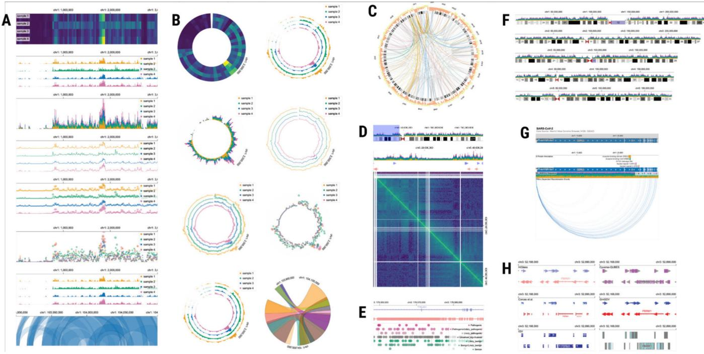  
Fig. 1. Genomics Data Visualizations Using Gosling.  
A wide range of genomics visualizations in the wild can be expressed by Gosling and rendered by Gosling.js, a declarative grammar and its JavaScript toolkit for scalable and interactive visualizations for genome-mapped data.

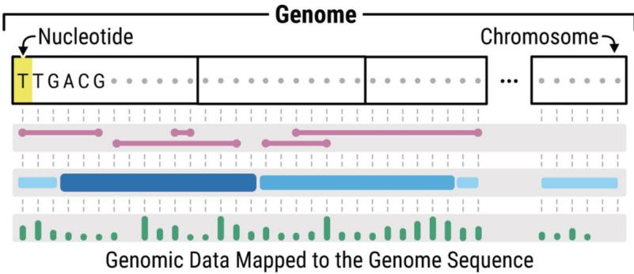  
Fig. 2. Genomes, Data, and Visualization.

Top: A genome is the sequence of all nucleotides on all chromosomes. It is defined by a reference sequence of nucleotides and a chromosome order. Bottom: Nominal, ordinal, or continuous measurements can be mapped onto the genome sequence to define genomic features. The data within a light gray rectangle is typically referred to as a track.

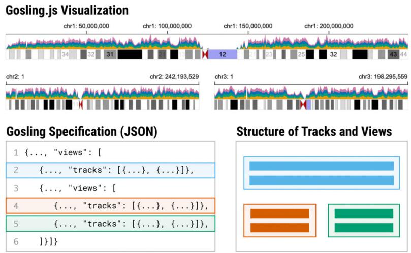  
Fig. 3. Hierarchical Structure of Tracks and Views.  
This figure shows a Gosling visualization (top) and its hierarchical structure of tracks and views (bottom right). Gosling uses a JSON format specification as input (bottom left). Each of the three views shown in this figure (blue, orange, and green) consists of two tracks (stacked area charts and ideograms).

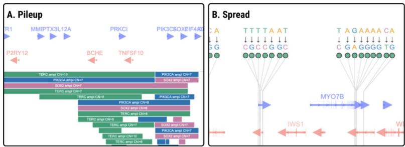  
Fig. 4. Displacement of Marks.  
Using displacement options, users can pile up (left bottom) or spread out (right top) marks to remove overlap.

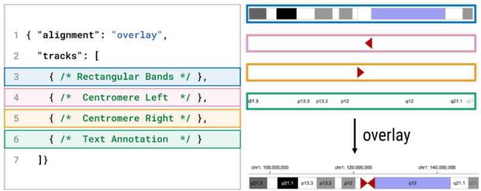  
Fig. 5. Overlaying Tracks.

Using an overlay option of an alignment property, multiple tracks can be superposed on top of each other, allowing to create glyph-based representations, such as ideograms and gene annotations. This figure shows an example that overlays rectangular, triangular, and textual marks to create ideograms.

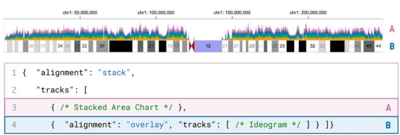  
Fig. 6. Track Alignment.

Tracks can be either stacked or overlaid. The ability to nest multiple tracks with different alignment options allows flexible track composition. This figure shows an area chart that is juxtaposed with an ideogram (i.e., overlaid tracks).

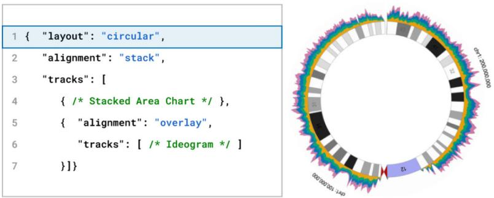  
Fig. 7. View Layout.

Specifying the layout property to either “linear” or “circular” encodes genomic positions in Cartesian coordinates or polar coordinates, respectively. The example in this figure adds a single line of code (line 1) from Fig. 6 to circularize the visualization.

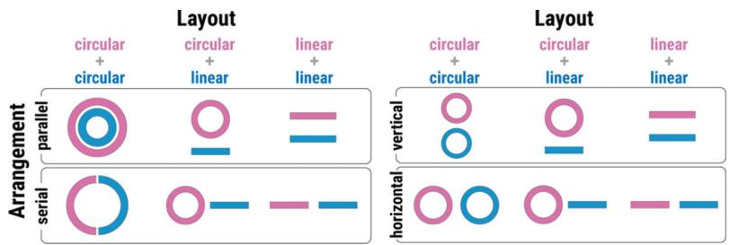  
Fig. 8. View Arrangement.  
Four arrangement options used in different layouts cover broad arrangement of views (pink and blue).

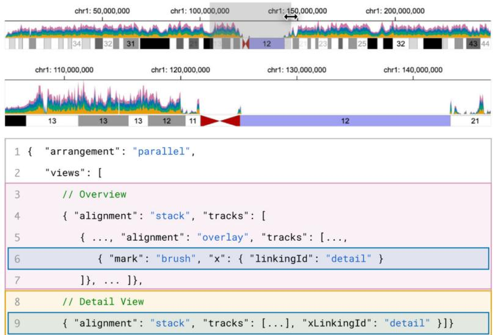  
Fig. 9. Coordinated Views with Interactive Brushes.

An interactive brush can be linked with other views by having the same linkingId value. The brush makes it easy to adjust the genomic locations of another view by adjusting the left and right edges of the brush.

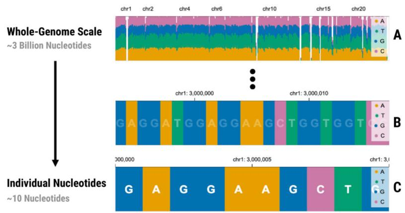

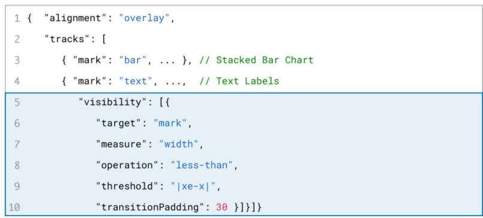  
Fig. 10. Multi-Scale Encoding with Semantic Zooming.  
For each track, users can define multiple visual encodings and switch between them using Boolean expressions in the visibility property. This figure shows a multi-scale sequence plot that shows the overall distribution of nucleotides using stacked bar charts which change to show individual nucleotides in detail upon zooming in enough.

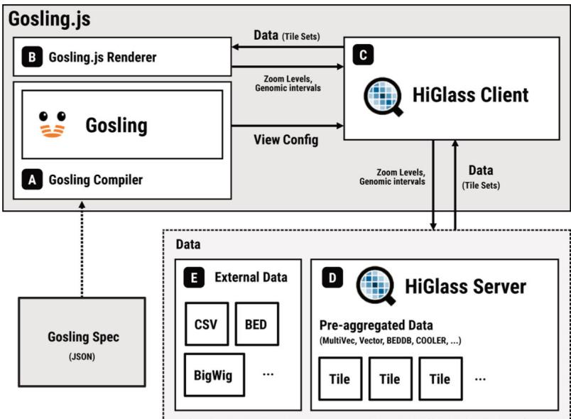  
Gosling.js consists of three main components: (A) a compiler, (B) a renderer, and (C) a HiGlass client [34].  
Fig. 11. System Structure of Gosling.js.

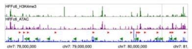

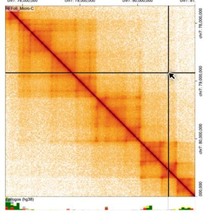

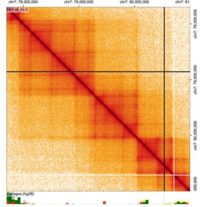  
Fig. 12. Comparison of Micro-C and Hi-C.  
Comparative matrix visualizations of Micro-C (left) and Hi-C (right) for HFFc6 cells (Tota 23.0 GB, 7 files) [35].

(A) A circular overview with two linear detail views and interactive brushes (Total 4.0 GB, 2 files) [36,88]. (B) An interactive version of a static figure (Total 0.9 GB, 12 files) [11].

A. Overview + Detail  
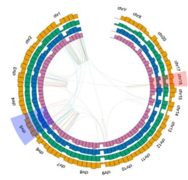

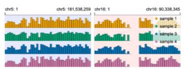  
Fig. 13. Examples Using Gosling.

B. Interactive Figure (Corces et al. 2020)  
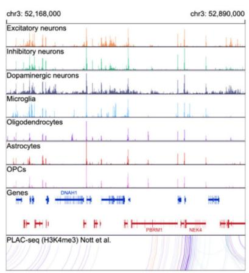

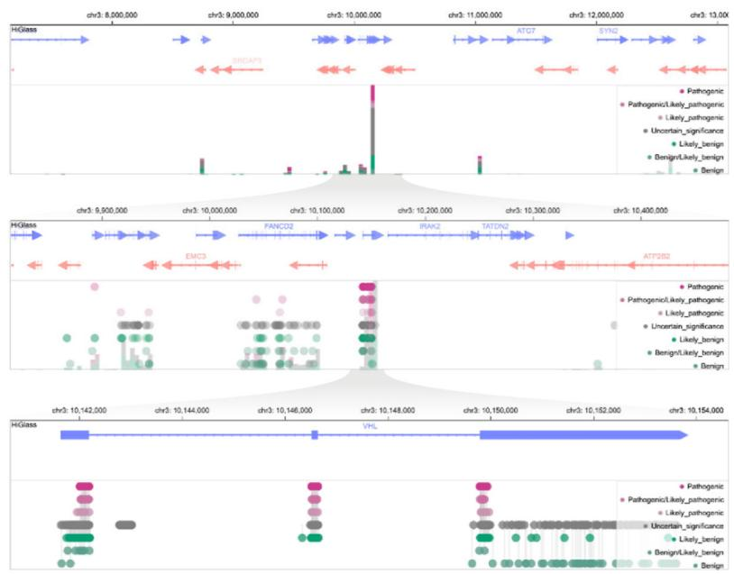  
Using semantic zooming for showing relationship between sequence variations and phenotypes using stacked bar charts and lollipop plots (Total 0.6 GB, 3 files) [37].  
Fig. 14. Multi-Scale Lollipop Plots.

<table><tr><td>Principle</td><td>Vega-Lite [70]</td><td>GenomeSpy [39]</td><td>Circos [36]</td><td>ggBio [87]</td><td>IGV [79]</td><td>HiGlass [34]</td><td>Gosling.js</td></tr><tr><td>Encoding</td><td></td><td></td><td></td><td></td><td>- (Template-based)</td><td>- (Template-based)</td><td></td></tr><tr><td>Linear (Layout)</td><td></td><td></td><td></td><td></td><td></td><td></td><td></td></tr><tr><td>Circular (Layout)</td><td></td><td></td><td></td><td></td><td></td><td></td><td></td></tr><tr><td>Stack (Alignment)</td><td></td><td></td><td></td><td></td><td></td><td></td><td></td></tr><tr><td>Overlay (Alignment)</td><td></td><td></td><td></td><td></td><td></td><td></td><td></td></tr><tr><td>Parallel (Arrangement)</td><td></td><td></td><td></td><td></td><td></td><td></td><td></td></tr><tr><td>Serial (Arrangement)</td><td></td><td></td><td></td><td></td><td></td><td></td><td></td></tr><tr><td>Data Scalability</td><td></td><td></td><td></td><td></td><td></td><td></td><td></td></tr><tr><td>Multi-Scale Encoding</td><td></td><td></td><td></td><td>(Limited Semantic Zoom)</td><td></td><td></td><td>• (Semantic Zoom)</td></tr><tr><td>Coordinated Interactivity</td><td>O (No &quot;View&quot;Composition)</td><td>O (No Brushing and Linking)</td><td></td><td></td><td></td><td></td><td></td></tr><tr><td>Domain Specificity</td><td></td><td> (SelectAdditions)</td><td></td><td></td><td></td><td></td><td></td></tr></table>

Comparison of Gosling.js with popular genomics visualization tools that support customization.