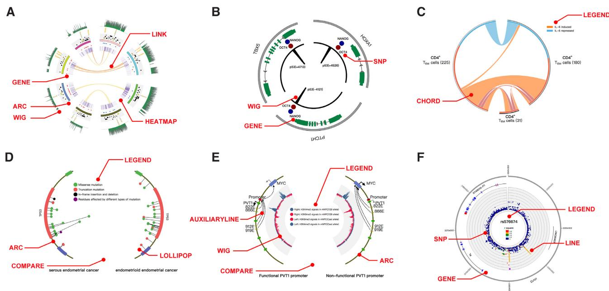
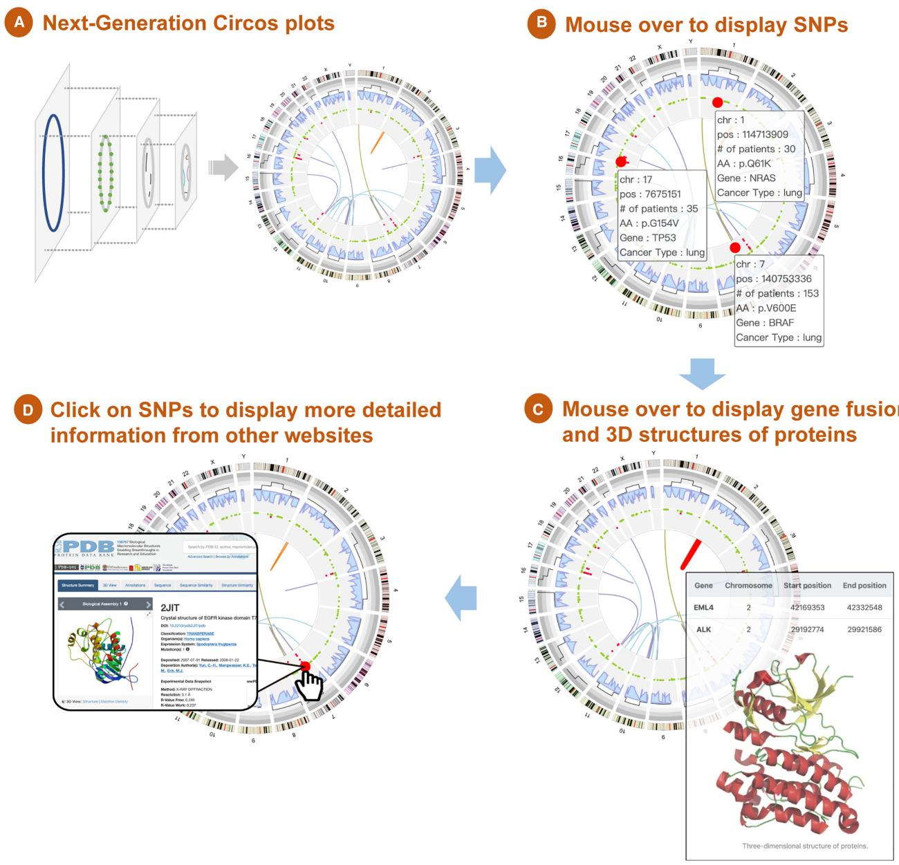

# NG-Circos: next-generation Circos for data visualization and interpretation

Ya Cui 1,†, Zhe Cui2,†, Jianfeng Xu2, Dapeng Hao2, Jiejun Shi1, Dan Wang3, Hui Xiao1, Xiaohong Duan4, Runsheng Chen5 and Wei Li 1,\*

1Division of Computational Biomedicine, Department of Biological Chemistry, School of Medicine, University of California, Irvine, CA 92697, USA, 2Division of Biostatistics, Dan L Duncan Cancer Center and Department of Molecular and Cellular Biology, Baylor College of Medicine, Houston, TX 77030, USA, 3Department of Medicine, Division of Cardiology, University of California, Los Angeles, CA 90095, USA, 4ChosenMed Technology (Beijing) Co. Ltd, Beijing 100176, China and 5CAS Key Laboratory of RNA Biology, Institute of Biophysics, Chinese Academy of Sciences, Beijing 100101,China

Received May 15, 2020; Revised August 04, 2020; Editorial Decision August 21, 2020; Accepted August 25, 2020

## ABSTRACT

Circos plots are widely used to display multidimensional next-generation genomic data, but existing implementations of Circos are not interactive with limited support of data types. Here, we developed next-generation Circos (NG-Circos), a flexible JavaScript-based circular genome visualization tool for designing highly interactive Circos plots using 21 functional modules with various data types. To our knowledge, NG-Circos is the most powerful software to construct interactive Circos plots. By supporting diverse data types in a dynamic browser interface, NG-Circos will accelerate the next-generation data visualization and interpretation, thus promoting the reproducible research in biomedical sciences and beyond. NG-Circos is available at https://wlcb. oit.uci.edu/NG-Circos and https://github.com/YaCui/ NG-Circos.

## INTRODUCTION

Visualizing increasing volumes of next-generation biological data is critical to the interpretation of such data. Circos plots are circular two-dimensional visual representations that provide a comprehensive solution for presentation and interpretation of multi-dimensional genomic data. Circos (1), the predominant tool for making Circos plots, has been wildly used for complex biological data visualization in many studies. However, Circos’s outputs are not interactive. Other Circos-derived tools, such as Circoletto (2), CIRCUS (3), J-Circos (4), shinyCircos (5), Rcircos (6), Circleator (7), OmicCircos (8), ggbio (9) are either incapable to produce interactive Circos plots in a web browser or are limited to specific data types. Our previous developed tool, Bio-

Circos.js (10), appears to be the only published software capable of producing interactive Circos plots and has become the state-of-the-art tool in the field (11–12). Nonetheless, BioCircos.js (10) implements only nine functional modules, limiting its scope to perform additional analytical tasks.

To address this weakness, here we developed nextgeneration Circos (NG-Circos), a JavaScript-based circular genome visualization tool that extends beyond the framework of BioCircos.js (10) to integrate and interpret genomic data types through interactive Circos plots. NG-Circos currently contains 21 modules, enabling various functions that were absent in other tools (including BioCircos.js (10)). By supporting diverse types genomic data types in an interactive browser interface, NG-Circos will accelerate the nextgeneration data visualization and interpretation, thus promoting reproducible research in biomedical sciences and beyond.

## MATERIALS AND METHODS

## Implementation of NG-Circos

NG-Circos is written in JavaScript and generates interactive graphics with SVG element based on D3.js (data-driven documents) and jQuery.js. Based on JavaScript, NG-Circos can be used without installing additional packages. After downloading NG-Circos, users can reproduce almost all circular plots drawn by Circos with a web browser. Note that NG-Circos itself is not a web application, but is a library to build interactive Circos plots in web applications.

## Implementing image-download function in NG-Circos

The download function in NG-Circos is built using the svg-crowbar.js (https://nytimes.github.io/svg-crowbar/) from The New York Times. NG-Circos now supports the

  
Figure 1. Demos of NG-Circos. (A) Complex published Circos plots reproduced using NG-Circos; detailed descriptions can be found in Akdemir et al. (15). (B) Demo showing gene structures using NG-Circos; data are from Akdemir et al. (15). (C) Demo of Chord plot showing the IL-6-regulated gene changes in different cells (17). (D) Demo of Lollipop plot designed by NG-Circos; data are from Schultheis et al. (18). (E) Demo of COMPARE module in NG-Circos. Mutations in the PVT1 promoter change enhancer target genes. Wig plot shows the H3K4me3 (blue) and H3K9me3 (red) modifications (19). (F) Demo of LocusZoom plot designed by NG-Circos. The module names of tracks in (A–F) are marked with red text.

SVG and PNG formats. The SVG image format allows users to extract high-quality images that can be further utilized in Adobe Illustrator.

## Input data processing in NG-Circos

We provide a data processing script (written by python and shell) for processing raw data, enabling users to easily transform their data into JSON format with default parameters for corresponding module. Notably, the input data of NG-Circos can be either generated by the supporting python scripts, or directly through the well-documented JSON data formats. Users can integrate NG-Circos into an existing JavaScript based web application which has its own internal JSON data structures. We provide an example for each module to illustrate the input data structure and all the steps needed to recreate that example (https://wlcb.oit.uci. edu/modules/).

## Processing GWAS data in LocusZoom plot

In Figure 1F, we used PLINK (13) to calculate the r-square value of specific populations and to extract the recombination rate from the Hapmap3 data (14) for specified SNPs.

## Web browsers supported by NG-Circos

The running speed of NG-Circos depends on the computing power of browsers and hardware. NG-Circos has passed the debugging and examination in all major internet browsers including Google Chrome, Internet Explorer/Edge, Mozilla Firefox, Safari and Opera.

## RESULTS

## Workflow of NG-Circos

NG-Circos has a highly user-friendly workflow. It has three main steps to draw an interactive Circos plot: Step 1 includes drawing chromosomes (or other segments) as the coordinate axes. Step 2 involves adding various data tracks using the relevant modules with high flexibility in module choices (21 modules are currently implemented, Supplementary Table S1). The input data of NG-Circos can be either generated by the supporting python scripts, or directly through the well-documented JSON data formats. For each module, we provide one example which includes the input data files and all the steps to recreate that example (https://wlcb.oit.uci.edu/modules/). Finally, step 3 incorporates interactive animations, mouse events (Supplementary Table S2) and designing toolboxes for graphic elements. NG-Circos is highly customizable, allowing users to adjust personal settings. We also provide a set of carefully evaluated default settings for each module and provide many demos to make NG-Circos easy to use. In addition, the capability of NG-Circos can be simply broadened by including more functional modules in step 2.

## NG-Circos provides flexible module choices for diverse Circos plots

The current version of NG-Circos consists of 21 modules (Supplementary Table S1). The combination of modules in NG-Circos allows users to construct diverse types of Circos plots. For example, NG-Circos can reproduce complex published Circos plots (15) by combining ARC, GENE,

  
Figure 2. Using NG-Circos for integrative data visualization and interpretation. (A) Flexibly combing various modules in NG-Circos to visualize multiple biological data types. The outer ring represents chromosome ideograms. Moving inward from the outer ring, the data tracks represent somatic CNVs, variant density, somatic mutations and gene fusions. Except for simulated variant density data, all data shown are downloaded from the COSMIC database. (B) Mouse over to show details of each SNP. (C) Mouse over to show details of each gene fusion and its 3D protein structure (in this case, the EML4- ALK gene fusion). (D) Click on a SNP (in this case, the EGFR T790M variant) to open a new web page in the PDB database displaying the T790M variant-affected 3D structure of EGFR (PDB code: 2JIT).

HEATMAP, LINK and WIG modules (Figure 1A). Not only can NG-Circos reproduce complex published Circos plots, but also can it renders additional functions such as providing popular interactive Circos plot demos (e.g. Lollipop, Wig and LocusZoom (16) plots) shown in Figure 1B–F (15) (17) (18) (19), that are not seen in other tools. Moreover, we offer more demos in the online website (https: //wlcb.oit.uci.edu/NG-Circos) to show the power of this tool: users can easily replace the demo data with their data to produce their own plots. All figures can be download in the SVG and PNG format, in which the SVG format renders users high-quality images that could be further utilized through other applications such as the Adobe Illustrator.

Overall, NG-Circos offers users great flexibility in module choices and Circos plot types.

## Case study for interactive data exploration using NG-Circos

Here we present a case study to further illustrate the power of interactive data exploration using NG-Circos. In this case, users can interactively explore driver single nucleotide polymorphisms (SNPs), gene fusions and their impact on protein structure in lung cancer (Figure 2). For example, mouse over events show the SNP frequencies in lung cancer from the Catalogue of Somatic Mutations in Cancer (COS-MIC) database (Figure 2B) (20) and the three-dimensional (3D) protein structure of an EML4-ALK gene fusion (Figure 2C) (21). Remarkably, NG-Circos can also redirect elements (such as SNPs or gene fusions) to external resources. For instance, clicking on a SNP, such as the EGFR T790M variant, opens up a new Protein Data Bank (PDB) database webpage, displaying the T790M variant-affected 3D structure of EGFR (Figure 2D; PDB code: 2JIT) (22). To sum up, NG-Circos serves as a great tool to explore genomic data interactively such that users can extract additional information by mouse hovering and clicking on the plots.

## DISCUSSION

Interactive data exploration across diverse data types will certainly promote the next-generation data visualization and interpretation, with some successful examples, such as cBioPortal (23), seen in cancer research. Circos plots are widely used to display voluminous next-generation genomic data, but existing implementations of Circos does not generate interactive outputs, which hinders its usability. To address this issue, NG-Circos provides flexible modules choices for interactive data exploration and diverse Circos plots types. As additional types of genomic data are generated in the future, we will keep updating additional functional modules to extend the power of NG-Circos. We will also actively maintain NG-Circos and respond to inquiries from users. By supporting diverse types of genomic data in an interactive web interface, NG-Circos, we believe, will enhance genomic research in the biomedical field in the future.

## SUPPLEMENTARY DATA

Supplementary Data are available at NARGAB Online.

## ACKNOWLEDGEMENTS

We acknowledge Tianyi Zang, Yadong Wang and members of the Li lab for constructive discussions and support.

## FUNDING

No external funding.   
Conflict ofinterest statement. None declared.

## REFERENCES

1. Krzywinski,M., Schein,J., Birol,I., Connors,J., Gascoyne,R., Horsman,D., Jones,S.J. and Marra,M.A. (2009) Circos: an information aesthetic for comparative genomics. Genome Res., 19, 1639–1645.

2. Darzentas,N. (2010) Circoletto: visualizing sequence similarity with Circos. Bioinformatics, 26, 2620–2621.

3. Naquin,D., d’Aubenton-Carafa,Y., Thermes,C. and Silvain,M. (2014) CIRCUS: a package for Circos display of structural genome variations from paired-end and mate-pair sequencing data. BMC Bioinformatics, 15, 198.

4. An,J., Lai,J., Sajjanhar,A., Batra,J., Wang,C. and Nelson,C.C. (2015) J-Circos: an interactive Circos plotter. Bioinformatics, 31, 1463–1465.

5. Yu,Y., Ouyang,Y. and Yao,W. (2018) ShinyCircos: an R/Shiny application for interactive creation of Circos plot. Bioinformatics, 34, 1229–1231.

6. Zhang,H., Meltzer,P. and Davis,S. (2013) RCircos: an R package for Circos 2D track plots. BMC Bioinformatics, 14, 244.

7. Crabtree,J., Agrawal,S., Mahurkar,A., Myers,G.S., Rasko,D.A. and White,O. (2014) Circleator: flexible circular visualization of genome-associated data with BioPerl and SVG. Bioinformatics, 30, 3125–3127.

8. Hu,Y., Yan,C., Hsu,C.H., Chen,Q.R., Niu,K., Komatsoulis,G.A. and Meerzaman,D. (2014) Omiccircos: a simple-to-use R package for the circular visualization of multidimensional Omics data. Cancer Inform., 13, 13–20.

9. Yin,T., Cook,D. and Lawrence,M. (2012) ggbio: an R package for extending the grammar of graphics for genomic data. Genome Biol., 13, R77.

10. Cui,Y., Chen,X., Luo,H., Fan,Z., Luo,J., He,S., Yue,H., Zhang,P. and Chen,R. (2016) BioCircos.js: an interactive Circos JavaScript library for biological data visualization on web applications. Bioinformatics, 32, 1740–1742.

11. Juanillas,V., Dereeper,A., Beaume,N., Droc,G., Dizon,J., Mendoza,J.R., Perdon,J.P., Mansueto,L., Triplett,L., Lang,J. et al. (2019) Rice galaxy: an open resource for plant science. Gigascience, 8, giz028.

12. Nott,A., Holtman,I.R., Coufal,N.G., Schlachetzki,J.C.M., Yu,M., Hu,R., Han,C.Z., Pena,M., Xiao,J., Wu,Y. et al. (2019) Brain cell type–specific enhancer–promoter interactome maps and disease-risk association. Science, 366, 1134–1139.

13. Purcell,S., Neale,B., Todd-Brown,K., Thomas,L., Ferreira,M.A.R., Bender,D., Maller,J., Sklar,P., De Bakker,P.I.W., Daly,M.J. et al. (2007) PLINK: a tool set for whole-genome association and population-based linkage analyses. Am. J. Hum. Genet., 81, 559–575.

14. Belmont,J.W., Hardenbol,P., Willis,T.D., Yu,F., Yang,H., Ch’Ang,L.Y., Huang,W., Liu,B., Shen,Y., Tam,P.K.H. et al. (2003) The international HapMap project. Nature, 426, 789–796.

15. Akdemir,K.C., Jain,A.K., Allton,K., Aronow,B., Xu,X., Cooney,A.J., Li,W. and Barton,M.C. (2014) Genome-wide profiling reveals stimulus-specific functions of p53 during differentiation and DNA damage of human embryonic stem cells. Nucleic Acids Res., 42, 205–223.

16. Pruim,R.J., Welch,R.P., Sanna,S., Teslovich,T.M., Chines,P.S., Gliedt,T.P., Boehnke,M., Abecasis,G.R., Willer,C.J. and Frishman,D. (2011) LocusZoom: regional visualization of genome-wide association scan results. Bioinformatics, 26, 2336–2337.

17. Twohig,J.P., Cardus Figueras,A., Andrews,R., Wiede,F., Cossins,B.C., Derrac Soria,A., Lewis,M.J., Townsend,M.J., Millrine,D., Li,J. et al. (2019) Activation of na¨ıve CD4 + T cells re-tunes STAT1 signaling to deliver unique cytokine responses in memory CD4 + T cells. Nat. Immunol., 20, 458–470.

18. Schultheis,A.M., Martelotto,L.G., De Filippo,M.R., Piscuglio,S., Ng,C.K.Y., Hussein,Y.R., Reis-Filho,J.S., Soslow,R.A. and Weigelt,B. (2016) TP53 mutational spectrum in endometrioid and serous endometrial cancers. Int. J. Gynecol. Pathol., 35, 289–300.

19. Cho,S.W., Xu,J., Sun,R., Mumbach,M.R., Carter,A.C., Chen,Y.G., Yost,K.E., Kim,J., He,J., Nevins,S.A. et al. (2018) Promoter of lncRNA gene PVT1 is a tumor-suppressor DNA boundary element. Cell, 173, 1398–1412.

20. Forbes,S.A., Beare,D., Boutselakis,H., Bamford,S., Bindal,N., Tate,J., Cole,C.G., Ward,S., Dawson,E., Ponting,L. et al. (2017) COSMIC: somatic cancer genetics at high-resolution. Nucleic Acids Res., 45, D777–D783.

21. Wang,D., Li,D., Qin,G., Zhang,W., Ouyang,J., Zhang,M. and Xie,L. (2015) The structural characterization of tumor fusion genes and proteins. Comput. Math. Methods Med., 2015, doi:10.1155/2015/912742.

22. Yun,C.H., Mengwasser,K.E., Toms,A. V., Woo,M.S., Greulich,H., Wong,K.K., Meyerson,M. and Eck,M.J. (2008) The T790M mutation in EGFR kinase causes drug resistance by increasing the affinity for ATP. Proc. Natl. Acad. Sci. U.S.A., 105, 2070–2075.

23. Gao,J., Aksoy,B.A., Dogrusoz,U., Dresdner,G., Gross,B., Sumer,S.O., Sun,Y., Jacobsen,A., Sinha,R., Larsson,E. et al. (2013) Integrative analysis of complex cancer genomics and clinical profiles using the cBioPortal. Sci. Signal., 6, pl1.

24. Jiang,S., Xie,Y., He,Z., Zhang,Y., Zhao,Y., Chen,L., Zheng,Y., Miao,Y., Zuo,Z. and Ren,J. (2018) m6ASNP: a tool for annotating genetic variants by m6A function. Gigascience, 7, giy035.

25. Mateo,L., Guitart-Pla,O., Pons,C., Duran-Frigola,M., Mosca,R. and Aloy,P. (2017) A PanorOmic view of personal cancer genomes. Nucleic Acids Res., 45, W195–W200.

26. Teng,X., Chen,X., Xue,H., Tang,Y., Zhang,P., Kang,Q., Hao,Y., Chen,R., Zhao,Y. and He,S. (2020) NPInter v4.0: an integrated database of ncRNA interactions. Nucleic Acids Res., 48, D160–D165.