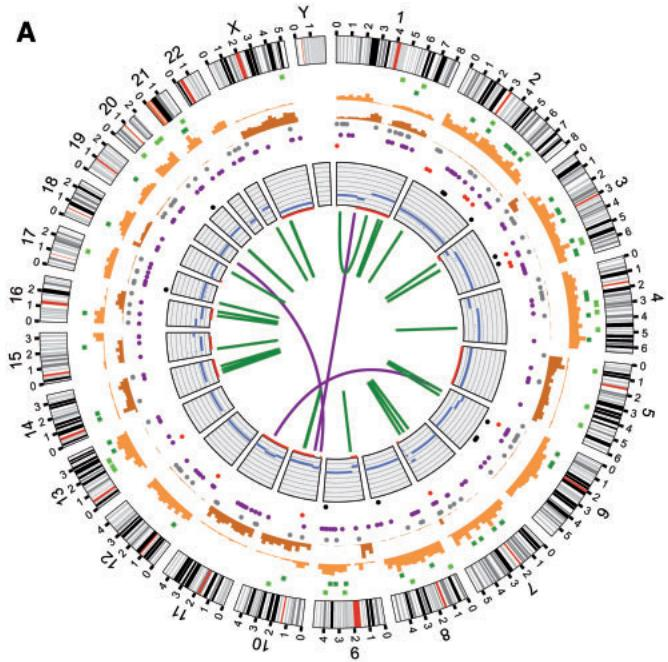
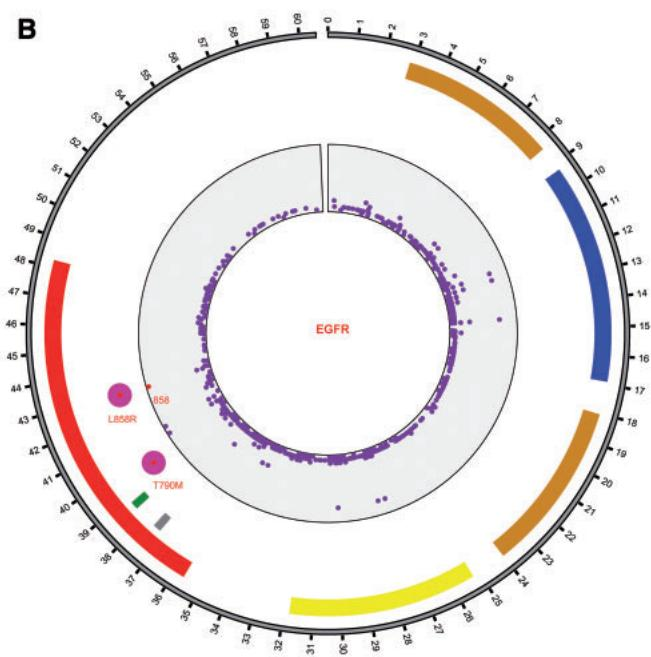

Genome analysis

# BioCircos.js: an interactive Circos JavaScript library for biological data visualization on web applications

Ya Cui1,2,3,†, Xiaowei Chen1,2,4,†, Huaxia Luo1,2, Zhen Fan1,2,4, Jianjun Luo1,2, Shunmin He5, Haiyan Yue1,2,3, Peng Zhang3 and Runsheng Chen1,2,6,\*

1Key Laboratory of RNA Biology, 2Beijing Key Laboratory of Noncoding RNA, Institute of Biophysics, Chinese Academy of Sciences, Beijing 100101, China, 3University of Chinese Academy of Sciences, Beijing 100049, China, 4Core Facility for Protein Research, Institute of Biophysics, 5Key Laboratory of the Zoological Systematics and Evolution, Institute of Zoology, Chinese Academy of Sciences, Beijing 100101, China and 6Research Network of Computational Biology, RNCB, Beijing 100101, China

\*To whom correspondence should be addressed.

†The authors wish it to be known that, in their opinion, the first two authors should be regarded as Joint First Authors. Associate Editor: John Hancock

Received on 5 November 2015; revised on 18 January 2016; accepted on 19 January 2016

## Abstract

Summary: We here present BioCircos.js, an interactive and lightweight JavaScript library especially for biological data interactive visualization. BioCircos.js facilitates the development of webbased applications for circular visualization of various biological data, such as genomic features, genetic variations, gene expression and biomolecular interactions.

Availability and implementation: BioCircos.js and its manual are freely available online at http://bio info.ibp.ac.cn/biocircos/.

Contact: rschen@ibp.ac.cn

Supplementary information: Supplementary data are available at Bioinformatics online.

## 1 Introduction

Multi-faceted and complex biological data increasingly require visualization and sophisticated analyses. However, suitable visualization tools are not always available to come readily at hand. Furthermore, many biological visualization tools are desktop applications that may be difficult to install and configure. Circos (Krzywinski et al., 2009) is a powerful Perl-based tool for illustrating genomic features, and is widely used in biological research. However, the graphical files it outputs are not interactive and users can thus not obtained further details by moving a mouse pointer over the data points. Alternatives to Circos, such as Circoletto (Darzentas, 2010), CIRCUS (Naquin et al., 2014) and Rcircos (Zhang et al., 2013), are also not interactive, whereas J-Circos (An et al., 2015), though interactive, is a desktop software. Web visualization applications have the advantage of generating interactive images in which all elements are interactive with mouse-over explanations and clickable buttons, and are thus far more userfriendly and provide more easily accessible information. As Circos and its alternatives do not function well on web applications, an interactive Circos-like tool for web applications would greatly facilitate visualization of biological data.

Based on the powerful D3 (Data-Driven Documents) (Bostock et al., 2011) and the jQuery JavaScript library, we have developed BioCircos.js, an interactive and lightweight JavaScript library especially adapted for interactive visualization of biological data on web applications. BioCircos.js thus facilitates the development of web applications for visualization of biological data in a circular format similar to that of Circos.

  
Fig. 1. Plots constructed with BioCircos.js. (A) Reproduced plots of published somatic mutations from a human cancer genome. The outer ring represents chromosome ideograms. From outside and inwards, the data tracks represent insertions, deletions, heterozygous substitutions, homozygous substitutions, cod ing substitutions (silent in grey, missense in purple, nonsense in red and splice site in black), copy number variation, LOH and rearrangements. A detailed description can be found in Pleasance et al., 2010. (B) Circular visualization of protein domains, mutations and drug targeted mutations in EGFR. The outer ring represents the positions of the amino acid in EGFR. The next four tracks (from outside and inwards) are protein domains, drug targeted indels (Deletion in exon 19 and insertion in exon 20, data from Shigematsu et al., 2005), drug targeted mutations (L858R and T790M) and mutations (data from the IntOGen database; Gonzalez-Perez et al., 2013) in the CDS respectively

## 2 Implementation

BioCircos.js is written in JavaScript and generates interactive graphics with SVG element based on D3 (Data-Driven Documents) and jQuery. BioCircos.js itself is not a web application, but a library that provides the functionality to build Circos-like web tools.

BioCircos.js provides the SNP, CNV, HEATMAP, LINK, LINE, SCATTER, ARC and HISTGRAM modules to display genome-wide genetic variations (SNPs, CNVs and chromosome rearrangement), gene expression and biomolecular interactions. BioCircos.js provides the BACKGROUND module to display background and axis circles, and also provides the TEXT module to facilitate the annotation of elements. Tooltips showing detailed information of SVG elements are also provided. With Twitter Bootstrap as the front-end framework, tooltips have an increased number of styles. A detailed document is available on the website.

BioCircos.js supports multiple-platforms and works in all major internet browsers (Google Chrome, Internet Explorer, Mozilla Firefox, Safari, Opera). Its speed is determined by the client’s hardware and the internet browser used.

## 3 Results

The main differences between BioCircos.js and Circos are threefold. (i) BioCircos.js provides a convenient way to construct web-based applications for interactive visualization of biological data in a circular format. Additionally, BioCircos.js can generate high quality SVG vector graphics. (ii) BioCircos.js is written in web client-side JavaScript, and can thus take advantages of many web features to achieve useful interactive effects, such as binding mouse events to data points, animation effects, etc, which are not available to the Perl-based Circos.

We consider this is the most important advantage of BioCircos.js. (iii) Biocircos.js can be used by conjunction with standard browsers, thereby circumventing a number of problems, such as fixing dependencies or upgrading Perl modules, which is often necessary to perform when installing Circos on a local computer.

To demonstrate the utility of BioCircos.js in generating circular images of biological data, we attempted to reproduce published Circos plots using BioCircos.js. A study published in 2010 reported a comprehensive catalogue of somatic mutations from a human cancer genome (Pleasance et al., 2010). We obtained all necessary data from the supplementary materials, including insertions, deletions, substitutions, copy number variations, loss of heterozygosity (LOH), and rearrangements, and used BioCircos.js to reproduce the plot containing all mutations (Fig. 1A). For example, we reproduced substitutions using SCATTER modules, and rearrangements using the LINK modules. A detailed description of data tracks can be found in Pleasance et al. (2010).

Figure 1A shows the ability to visualize multi-faceted biological data. Figure 1B shows how BioCircos.js can be used to visualize other types of biological data, in this case the amino acid sequence of the EGFR. The protein domains and SNPs in CDS are displayed using the ARC and SCATTER modules (Gonzalez-Perez et al., 2013; Shigematsu et al., 2005), so that the further away an SNP is located from the center, the higher its mutational frequency in population. Drug targeted mutations and indels are also displayed in the plot, all drug targeted mutations being located in the kinase domain. The mutation L858R (target of Afatinib, Iressa and Tarceva) has a higher frequency in population, and Figure 1B clearly demonstrates the significance of L858R in drug design. To further illustrate the utility of BioCircos.js, we have provided three additional examples in the supplementary.

## 4 Conclusion and outlook

BioCircos.js is not a web application for end-users but a JavaScript library for programmers. Developers need to write code around BioCircos.js to build web applications. BioCircos.js provides flexible and powerful functionality for the development of web-based circular visualization tools for multi-faceted biological data. These applications will be developed as plugins to simplify the process of generating circular image. We will continue to develop BioCircos.js to provide more features and support to the research community.

## Acknowledgements

We are grateful to Aiping Wu for thoughtful discussions and valuable comments on BioCircos.js design. We thank Geir Skogerbø for careful reading and valuable suggestions on the manuscript.

## Funding

This work was supported by grants from the National High Technology Research and Development Program (‘863’ Program) of China (2014AA021103, 2015AA020108 and 2014AA021502) and the National Natural Science Foundation of China (31520103905).

Conflict of Interest: none declared.

## References

An,J. et al. (2015) J-Circos: an interactive Circos plotter. Bioinformatics, 31, 1463–1465.

Bostock,M. et al. (2011) Data-Driven Documents. IEEE Trans. Vis. Comput. Graph, 17, 2301–2309. D(3):

Darzentas,N. (2010) Circoletto: visualizing sequence similarity with Circos. Bioinformatics, 26, 2620–2621.

Gonzalez-Perez,A. et al. (2013) IntOGen-mutations identifies cancer drivers across tumor types. Nat. Methods, 10, 1081–1082.

Krzywinski,M. et al. (2009) Circos: an information aesthetic for comparative genomics. Genome Res., 19, 1639–1645.

Naquin,D. et al. (2014) CIRCUS: a package for Circos display of structural genome variations from paired-end and mate-pair sequencing data. BMC Bioinf., 15, 198.

Pleasance,E.D. et al. (2010) A comprehensive catalogue of somatic mutations from a human cancer genome. Nature, 463, 191–196.

Shigematsu,H. et al. (2005) Clinical and biological features associated with epidermal growth factor receptor gene mutations in lung cancers. J. Natl. Cancer Inst., 97, 339–346.

Zhang,H. et al. (2013) RCircos: an R package for Circos 2D track plots. BMC Bioinf., 14, 244.